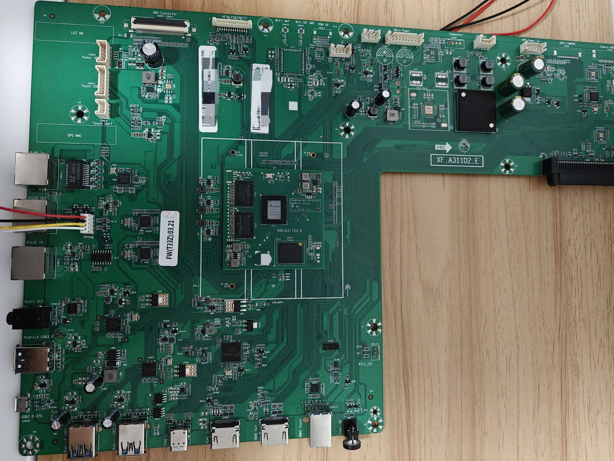
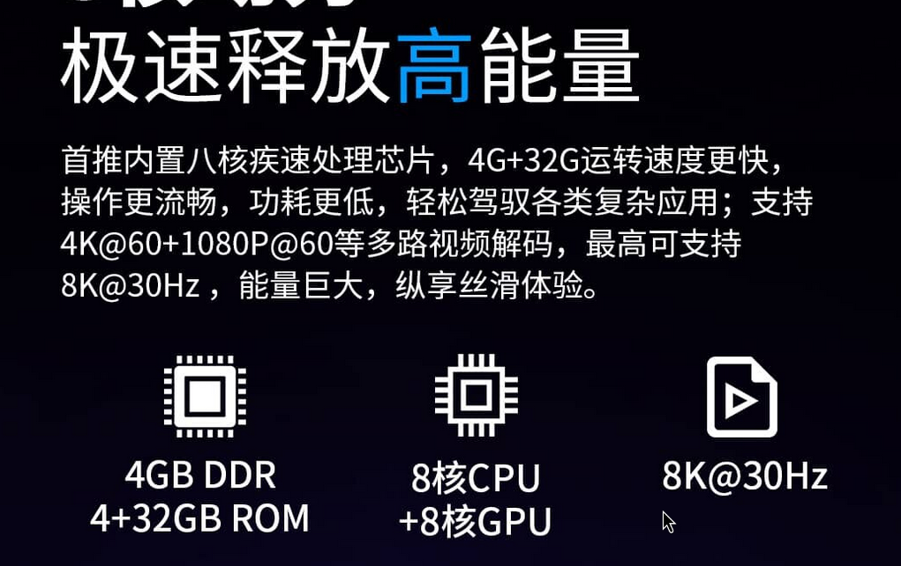
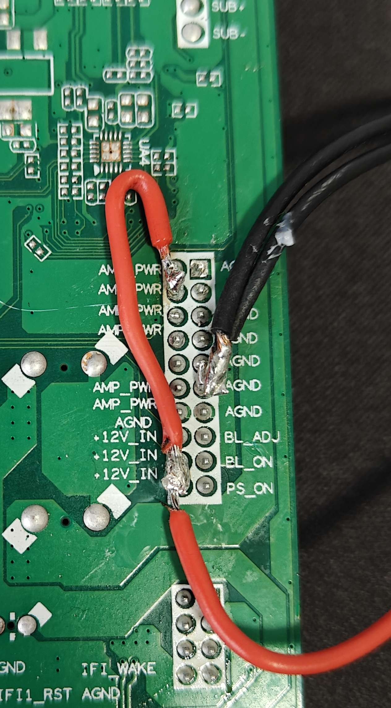
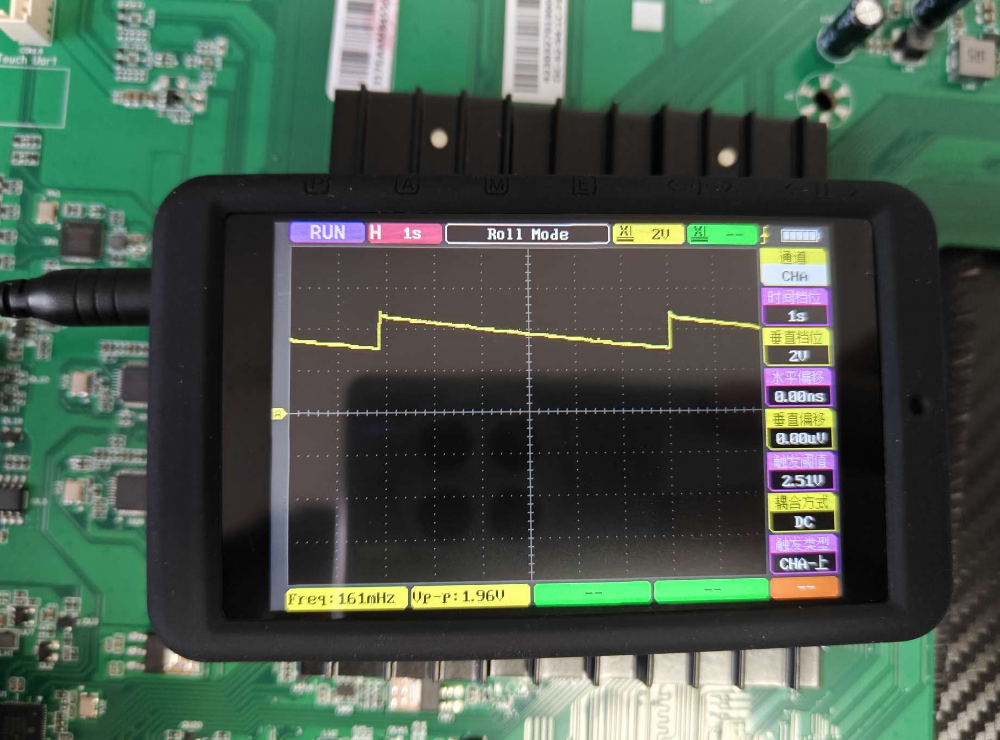
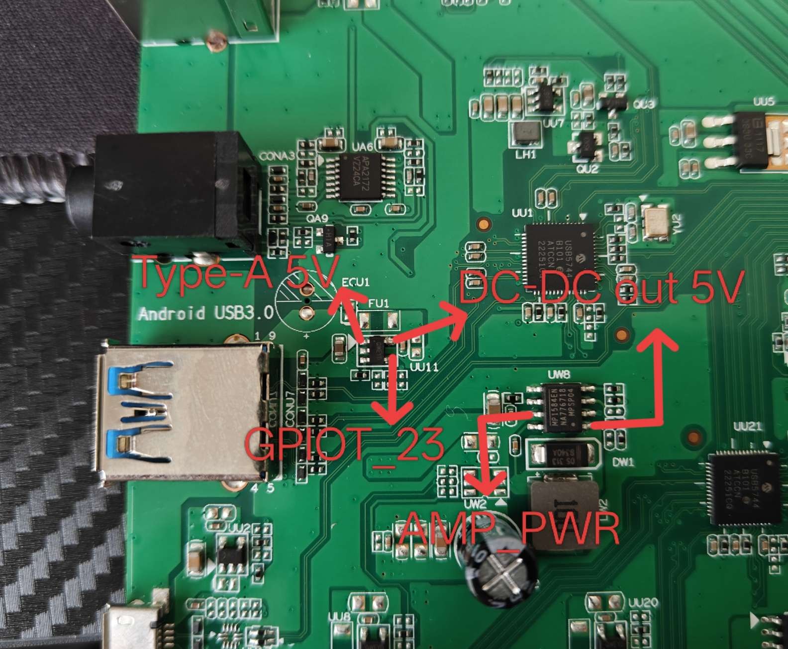
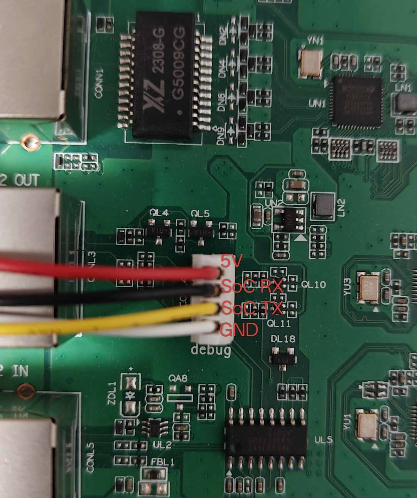
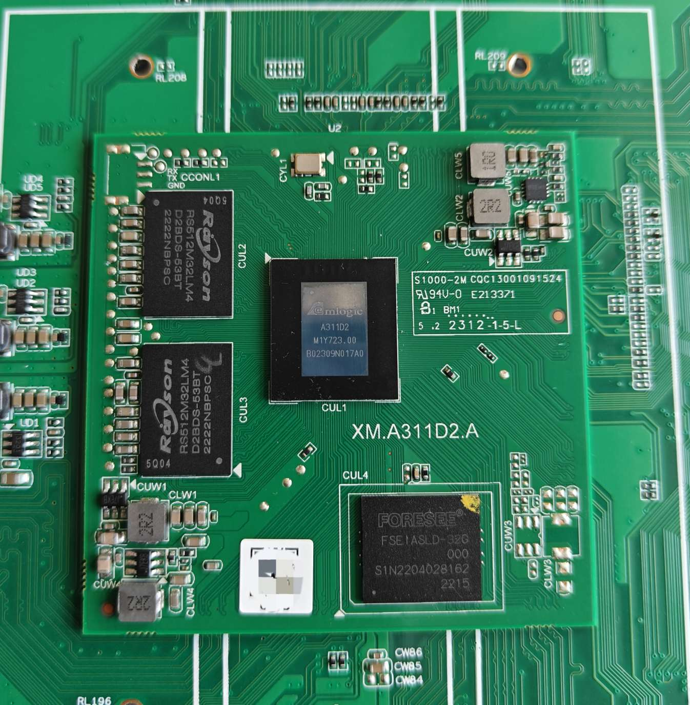
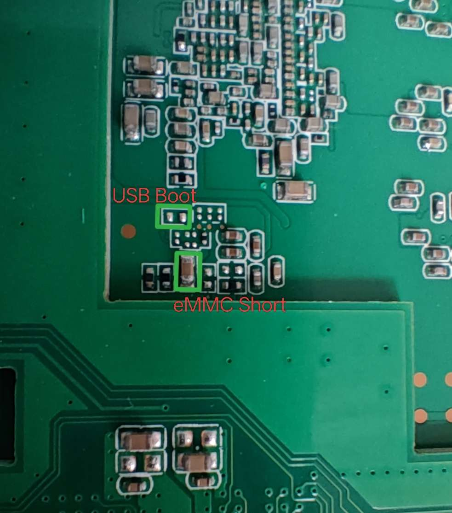

# 固件

[Armbian](https://github.com/retro98boy/armbian-build)

[CoreELEC](https://github.com/retro98boy/CoreELEC)

# 硬件

AOC的电子教学白板主板，原机安卓系统显示型号为65T33Z

Amlogic A311D2主控，作者购买的板子都是T7版本，未见到T7C版本

4G RAM加32G eMMC，同样，作者买到的都是这个存储配置



官方介绍[页面](https://www.aocdisplay.com.cn/sku-3085)，从图片中可以确定，只有4+32的版本



## 供电



在板子背面可以看到供电连接器的pin定义。接上12V供电板子就可以开机，但是USB接口无供电，所以还要将AMP_PWR接到 ~~5V（推荐购买12V转5V模块）~~ 12V供电

作者本来给AMP_PWR提供5V供电。但是在使用Armbian时发现Type-A供电能力差，只能带U盘，USB转NVMe硬盘无法工作。CoreELEC下Type-A甚至识别不到USB设备。测量Type-A的5V波形后发现不正常：



所以猜测提供Type-A 5V的DC-DC存在问题，经过一顿测量，Type-A 5V的电路如下：



应该是MP1584EN的输入（AMP_PWR）电压于其外围配置不符。尝试将AMP_PWR修改成12V后，Type-A 5V的输出便稳定了，且USB5744 Hub在U-Boot下也正常工作了（可以从Type-A加载内核）。这说明AMP_PWR也影响着USB5744

## 调试串口



波特率为921600

## 核心板





短接USB Boot再上电会进入USB下载模式

短接eMMC Short电容两边会让eMMC无法工作。所以先短接，再上电，BootROM会跳过eMMC，直接从其他设备例如SD卡启动bootloader。但是和之前的SoC例如A311D不同，不会fallback到USB下载模式。要使用USB下载，还是得短接上图USB Boot的点。注意，如果没有特殊需求，尽量不要短接eMMC，不确定该操作是否安全。该载板无SD卡槽，所以eMMC Short点位意义不大

# U-Boot

U-Boot源码：[khadas-u-boot](https://github.com/retro98boy/khadas-u-boot/tree/khadas-vims-v2019.01)和[coreelec-u-boot](https://github.com/retro98boy/coreelec-u-boot/tree/khadas-vims-v2019.01)，正如仓库名，分别fork自Khadas和CoreELEC，再开发

khadas-u-boot被[fenix](https://github.com/retro98boy/fenix)使用

coreelec-u-boot被[Armbian](https://github.com/retro98boy/armbian-build)和[CoreELEC](https://github.com/retro98boy/CoreELEC)使用。Armbian官方在一次提交后从Khadas的U-Boot源码改成CoreELEC的，且需要打一些[补丁](https://github.com/retro98boy/armbian-build/tree/main/patch/u-boot/u-boot-meson-s4t7)

## 编译U-Boot

首先下载`riscv-none-embed-gcc-xpack`和`aarch64-linux-gnu`工具链

Khadas的fenix脚本使用v8.3.0-1.2版本的`riscv-none-embed-gcc-xpack`，[下载链接](https://github.com/xpack-dev-tools/riscv-none-embed-gcc-xpack/releases/tag/v8.3.0-1.2)，作者实测xpack-riscv-none-embed-gcc-10.2.0-1.2同样可以兼容

`aarch64-linux-gnu`[下载链接](https://releases.linaro.org/components/toolchain/binaries/7.3-2018.05/aarch64-linux-gnu/gcc-linaro-7.3.1-2018.05-x86_64_aarch64-linux-gnu.tar.xz)

将工具链解压到某个位置并准备U-Boot源码后，开始编译：

```
# 设置环境变量
export PATH=$PATH:/workspace/toolchain/xpack-riscv-none-embed-gcc-8.3.0-1.2/bin
export CROSS_COMPILE=/workspace/toolchain/gcc-linaro-7.3.1-2018.05-x86_64_aarch64-linux-gnu/bin/aarch64-linux-gnu-

# 编译khadas-u-boot
# 构建BL33和FIP
bash fip/mk_script.sh 65t33z /workspace/u-boot/khadas-u-boot

# 编译coreelec-u-boot
make 65t33z_defconfig
# 编译BL33即U-Boot
make -j$(nproc)
# 构建FIP
bash fip/mk_script.sh 65t33z /workspace/u-boot/coreelec-u-boot
```

之所以coreelec-u-boot要分步编译而khadas-u-boot只需一条命令，是因为该[提交](https://github.com/CoreELEC/u-boot/commit/7f0145c9b759e6dda33e6beb3cdb7bd353cafe14)

两种源码编译后输出都在fip/_tmp目录下，三个文件很重要`u-boot.bin.sd.bin.signed` `u-boot.bin.signed` `u-boot.bin.usb.signed`。个人猜测`u-boot.bin.usb.signed`专用于USB下载模式sideload后实现线刷系统到eMMC。`u-boot.bin.sd.bin.signed`被刻录到MMC上，是实际起作用的bootloader。`u-boot.bin.usb.signed`的作用未知

如何将`u-boot.bin.sd.bin.signed`安装到eMMC/SD卡（复制自armbian-build/config/sources/families/meson-s4t7.conf）：

```
## funny enough, the uboot+fip blobs go in the same spot as normal meson64...
function write_uboot_platform() {
        dd if="$1/u-boot.bin.sd.bin.signed" of="$2" conv=fsync,notrunc bs=442 count=1       #> /dev/null 2>&1
        dd if="$1/u-boot.bin.sd.bin.signed" of="$2" conv=fsync,notrunc bs=512 skip=1 seek=1 #> /dev/null 2>&1
}
```

如何将这个三个文件替换到Amlogic Burn Tool线刷包里面完成替换bootloader？

首先解包线刷包，查看image.cfg：

```
[LIST_NORMAL]
file="DDR.USB"		main_type="USB"		sub_type="DDR"	file_type="normal"
file="DDR.USB"		main_type="USB"		sub_type="UBOOT"	file_type="normal"
file="aml_sdc_burn.UBOOT"		main_type="UBOOT"		sub_type="aml_sdc_burn"	file_type="normal"
file="aml_sdc_burn.ini"		main_type="ini"		sub_type="aml_sdc_burn"	file_type="normal"
file="_aml_dtb.PARTITION"		main_type="dtb"		sub_type="meson1"	file_type="normal"
file="platform.conf"		main_type="conf"		sub_type="platform"	file_type="normal"
file="usb_flow.aml"		main_type="aml"		sub_type="usb_flow"	file_type="normal"

[LIST_VERIFY]
file="_aml_dtb.PARTITION"		main_type="PARTITION"		sub_type="_aml_dtb"	file_type="normal"
file="bootloader.PARTITION"		main_type="PARTITION"		sub_type="bootloader"	file_type="normal"
```

再查看fenix编译脚本中的打包conf文件`build/images_upgrade-d0bcc7f98d8294fc9554d07370270610c6732168/Amlogic/package_t7.conf`：

```
#This file define how pack aml_upgrade_package image

[LIST_NORMAL]
#partition images, don't need verfiy
file="u-boot.bin.usb.signed"            main_type= "USB"            sub_type="DDR"
file="u-boot.bin.usb.signed"            main_type= "USB"            sub_type="UBOOT"
file="u-boot.bin.sd.bin.signed"         main_type="UBOOT"           sub_type="aml_sdc_burn"
file="platform.conf"                    main_type= "conf"           sub_type="platform"
file="aml_sdc_burn.ini"                 main_type="ini"             sub_type="aml_sdc_burn"
file="kvim.dtb"                         main_type="dtb"             sub_type="meson1"
file="usb_flow.aml"                     main_type="aml"             sub_type="usb_flow"

[LIST_VERIFY]
#partition images needed verify

#if you want download userdata image, uncomment below line
#file="userdata.img"     main_type="PARTITION"      sub_type="data"
#file="logo.img"                 main_type="PARTITION"    sub_type="logo"
file="rootfs.img"               main_type="PARTITION"    sub_type="rootfs"
file="u-boot.bin.signed"        main_type="PARTITION"    sub_type="bootloader"
file="kvim.dtb"                 main_type="PARTITION"    sub_type="_aml_dtb"
```

对比得出，只要将

u-boot.bin.usb.signed替换DDR.USB

u-boot.bin.signed替换bootloader.PARTITION

u-boot.bin.sd.bin.signed替换aml_sdc_burn.UBOOT

最后重新打包即可

# 内核

暂时只能使用供应商内核，最新版本是5.15

适用于Armbian的[dts](https://github.com/retro98boy/khadas-common-drivers)

适用于CoreELEC的[dts](https://github.com/retro98boy/coreelec-common-drivers)

## 音频

使用参考此处[此处](../corelab-tvpro/README.md#音频)

该板子和CoreLab TVPro音频方面的区别是少了一路LINE IN，多了一路I2S CODEC输出（其他未贴的电路不考虑）。暂时不驱动I2S CODEC的情况下，完全套用CoreLab TVPro的音频配置，HDMI和LINE OUT输出正常

## GPU

参考[此处](../corelab-tvpro/README.md#gpu)

# 安装系统

该设备无SD卡槽，所以只能将U-Boot安装到eMMC

~~该设备的USB5744 Hub在U-Boot下工作不正常，所以USB Type-A（由Hub扩展出来的）无法在U-Boot下使用。要从USB启动系统，需要通过Micro USB接口加OTG线材~~

要从USB启动系统，将U盘插入Type-A（有Android USB3.0字样）

## 刷入U-Boot

如果板子存在运行的系统且有root权限，直接参考上文的命令将U-Boot dd到eMMC即可

如果板子上运行的系统提权困难，或者不想自己编译U-Boot，直接可以使用[release界面](https://github.com/retro98boy/amlogic-devices/releases/tag/aoc-65t33z)提供的U-Boot线刷包刷入。注意要使用Amlogic Burn Tool v3版本，线刷口为Micro USB

注意，要U盘启动Armbian则刷入`aoc-65t33z-4g-u-boot-for-armbian-xxxx.burn.img`，要U盘启动CoreELEC则刷入`aoc-65t33z-4g-u-boot-for-coreelec-xxxx.burn.img`

## 安装系统到U盘

刷好对应的U-Boot到eMMC后，下载对应的系统镜像，解压后将.img刻录到U盘上。最后将U盘插入Type-A再开机即可

## 安装系统到eMMC

首先刷入`aoc-65t33z-4g-u-boot-for-armbian-xxxx.burn.img`到eMMC，再制作Armbian启动U盘启动系统

这时Armbian相当于一个PE/LiveISO，只需要将想安装的系统.img通过dd或者Netcat刻录到/dev/mmcblkN上即可（因为这些系统.img头部都存在bootloader）

选择Armbain作为PE/LiveISO是因为它更通用且能通过包管理器安装额外工具。用CoreELEC做PE/LiveISO也可以，但是想使用Netcat就无法通过包管理器来安装了

# dump原机系统

该设备没有SD卡槽，所以短接eMMC强制SoC从SD卡启动Armbian后再dump eMMC的方法失效

尝试在原机安卓U-Boot cmd下从U盘启动Armbian再dump，结果发现原机安卓的U-Boot无法驱动U盘

原机安卓有root权限，且可以驱动U盘，所以可以直接dd eMMC到U盘。但是这并不完美，因为在dd时，eMMC上的数据也会一直变化，备份出来img随机性大。且备份下来的系统也“不干净”（已经有用户数据）

所以作者使用USB下载模式下sideload U-Boot再启动Armbian来dump eMMC的方法

## 清理eMMC数据（非必需）

打开板子的串口shell，波特率115200（原机安卓的波特率）。开机进入安卓系统后，选择恢复出厂设置，然后观察串口shell。板子会立马重启，打印U-Boot的log，然后出现安卓内核的log，这时板子在recovery中清除用户数据，等待即可

清除完用户数据后，板子会再次重启并打印U-Boot的log。这时立马拔掉板子的供电，因为再运行下去，就会加载安卓内核开机进入OOBE。断电后，此时的eMMC是“干净”的（无用户数据）

## 制作U-Boot sideload包

解包`aoc-65t33z-4g-u-boot-for-armbian-xxxx.burn.img`，修改其中的image.cfg

删除`[LIST_VERIFY]`下的所有条目，确保不会把数据刷到eMMC导致eMMC数据丢失

删除`[LIST_NORMAL]`下`file="_aml_dtb.PARTITION"`这一行，否则在刷写该包时，Amlogic Burn Tool会执行eMMC初始化，同样会清除所有eMMC数据

最后重新打包即可。[release界面](https://github.com/retro98boy/amlogic-devices/releases/tag/aoc-65t33z)提供制作好的U-Boot sideload包，名为`aoc-65t33z-4g-u-boot-sideload-for-armbian-xxxx.burn.img`

## 启动Armbian

打开板子的串口shell，波特率921600

USB线连接Windows PC和板子Micro USB

短接板子的USB Boot点再给板子上电

Windows PC下用Amlogic Burn Tool v3“刷入”`aoc-65t33z-4g-u-boot-sideload-for-armbian-xxxx.burn.img`，由于这是个空包，只会sideload可以U盘启动Armbian的U-Boot到RAM，不会向eMMC写入任何数据

“刷入”成功后，拔掉Micro USB和Windows PC的连接，将刻录有Armbian.img的U盘插到板子的Type-A

在板子的串口shell中，按Ctrl-C暂停USB刷写程序，然后一直空格直至停在U-Boot cmd，最后输入boot并回车，U-Boot就会扫描U盘并从中启动Armbian

## 开始dump

进入Armbian shell后，就可以对eMMC为所欲为。由于整个eMMC较大，这里不使用dd的办法，使用Netcat直接将eMMC备份到Linux server并压缩

在Linux server上执行：

```
nc -l -p 1234 | zstd -T0 -c | split -b 512MiB - emmc-dump.img.zst.
```

在Armbian shell中执行：

```
nc -w 3 LinuxServer的IP 1234 < /dev/mmcblk0
```

耐心等待即可。注意/dev/mmcblk0boot0也要备份

[release界面](https://github.com/retro98boy/amlogic-devices/releases/tag/aoc-65t33z)提供作者设备的原机系统备份

## 恢复原机系统到eMMC

先参考上文通过USB启动Armbian作为PE/LiveISO

在Armbian shell中执行：

```
nc -l -p 1234 > /dev/mmcblk0
```

在Linux server上执行：

```
cat emmc-dump.img.zst.* | unzstd -T0 -c | nc -w 3 Armbian的IP 1234
```
