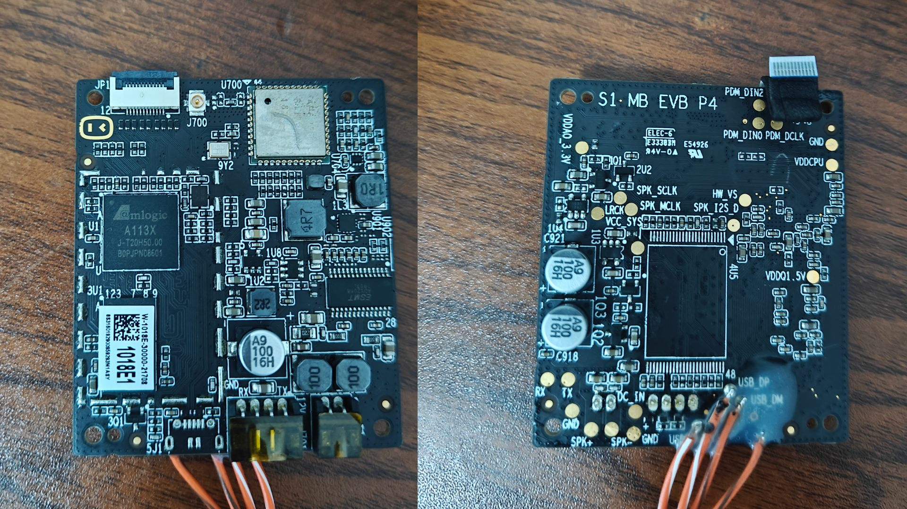
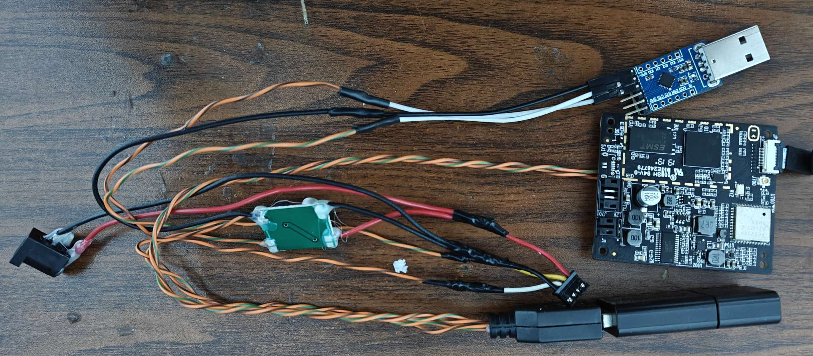
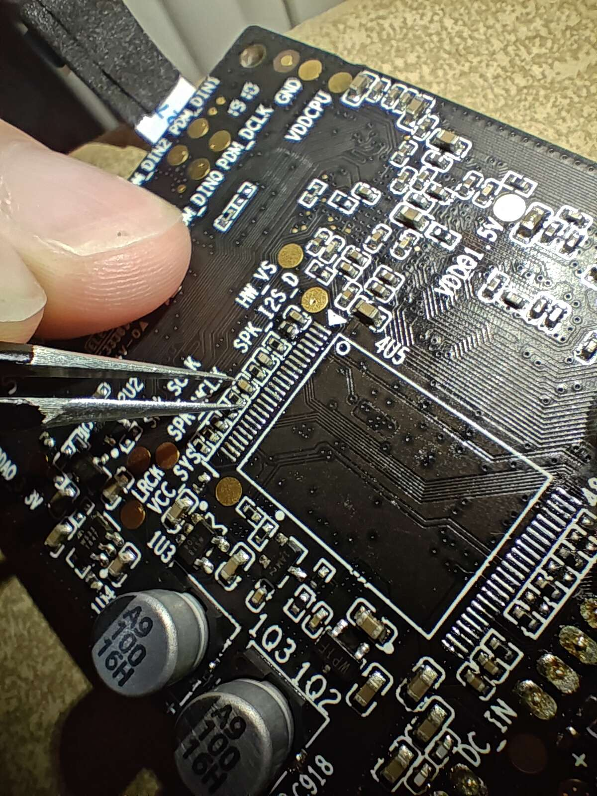
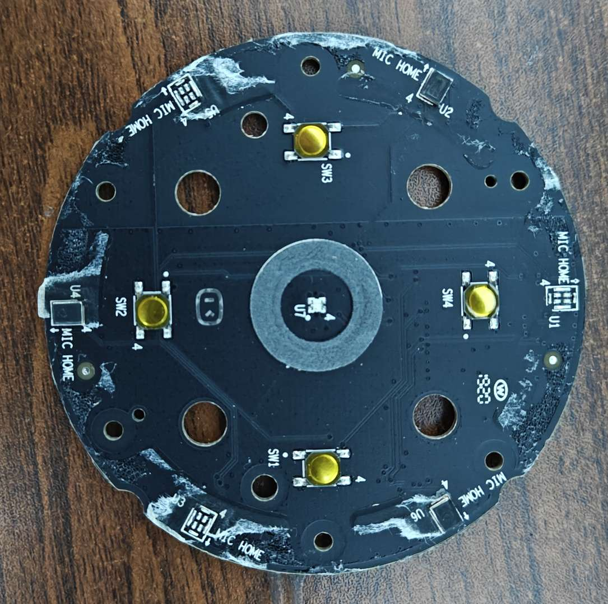

# 固件

[Buildroot](https://github.com/retro98boy/SlimFS)

# 硬件

小度人工智能音箱，型号XDH-01-A1

外观图和主板图如下：




12V DC供电，Amlogic A113X SoC，128MiB DDR，128MiB NAND，AP6236 WiFi/BT模组

主板有Micro-USB焊盘，同时有USB 2.0 DP DM测试点，所以很容易扩展USB 2.0 Type-A接口。主板上还有USB_PWR触点，尝试所有GPIO都无法控制其输出5V，也测试过对其输入5V电压给主板供电，但失败。所以要扩展Type-A接口，需要额外提供5V，推荐购买12V转5V降压模块用于Type-A

主板的4 pin连接器中存在UART，所以很方便就能接出来用于调试

改好UART的USB Type-A的设备如下图：




由于该设备使用TSOP封装的NAND来启动系统，很容易找到NAND短接点：



# 固件使用方法

## 注意事项

官方系统的NAND分区为：

```
0x000000000000-0x000000200000 : "bootloader"
0x000000440000-0x000000640000 : "tpl"
0x000000640000-0x000000a40000 : "boot0"
0x000000a40000-0x000000e40000 : "boot1"
0x000000e40000-0x000002240000 : "system0"
0x000002240000-0x000003640000 : "system1"
0x000003640000-0x000006c40000 : "opt"
0x000006c40000-0x000008000000 : "data"
```

在后续的操作中，一定要确保只能动boot0起始地址以后的部分，不要写、擦除前面的bootloader、tpl以及gap（里面可能存在BBT和U-Boot env），否则设备可能无法再启动。虽然有bootloader和tpl的备份，但是暂时未找到线刷回去的办法，可能只能拆NAND芯片用编程器（还不确定编程器写回是否有效）写入备份。该设备还开启了安全启动，所以无法使用自制bootloader

所以，执行所有命令前，应先`cat /proc/mtd`并核对命令中的mtdN，N是否正确

## 开始

将固件刻录到U盘上，将U盘插入扩展出来的Type-A。也可以使用USB Hub，这样不仅能接U盘，还能接USB网卡

PC使用USB串口模块连接主板的调试串口，波特率为115200

将板子上电，发现串口终端有输出，但是无法使用按键停在U-Boot cmd，等待内核/rootfs都加载完毕，发现想登录shell需要rid。咋一看无法下手，所以尝试短接法

将板子下电，将镊子搭在NAND短接点上但不要短接，眼睛看向串口终端

给板子上电，当终端跑码进入U-Boot后，立马短接NAND，NAND不可用后，U-Boot自然无法加载内核，就停在了U-Boot cmd（时机很重要，太早则没进入U-Boot便卡死。太晚则已经进入内核，卡死在内核。推荐先让设备正常启动几次，观察bootlog感受一下）

此时需要确定松开手后NAND还能否被驱动，执行`nand info`

输出类似下面则说明NAND还可以使用

```
axg_s420_v1#nand info

Device 0: A revision NAND 4Gib GD9FU1G8F2AMGI, sector size 128 KiB
  Page size      2048 b
  OOB size        128 b
  Erase size   131072 b
  size        2097152 b
Device 1: A revision NAND 4Gib GD9FU1G8F2AMGI, sector size 128 KiB
  Page size      2048 b
  OOB size        128 b
  Erase size   131072 b
  size       134217728 b
```

出现类似下面则说明这次上电周期NAND无法再使用了

```
axg_s420_v1#nand info

axg_s420_v1#
```

如果NAND还可以使用，执行下面的命令修改bootcmd，并将修改保存到NAND上，重启也不会丢失：

```
setenv bootcmd 'echo 'try boot from usb drive'; if usb start; then run try_usbdrive_bootcmd; fi; echo 'fallback to vendor boot'; run storeboot'

setenv try_usbdrive_bootcmd 'for usbdevnum in 0 1 2 3; do if fatload usb ${usbdevnum} 1020000 boot.scr; then setenv devtype usb; setenv devnum $usbdevnum; autoscr 1020000; fi; done'

saveenv && reset
```

完成上面的设置后，设备的Type-A口插入启动U盘则从U盘启动，不插入则启动官方的系统

如果之前短接再松开后，NAND无法再使用了，此时有两种办法。方法一，重新尝试短接，短接时机早点或晚点试试

方法二，直接执行下面的命令临时进入U盘系统：

```
setenv bootcmd 'echo 'try boot from usb drive'; if usb start; then run try_usbdrive_bootcmd; fi; echo 'fallback to vendor boot'; run storeboot'

setenv try_usbdrive_bootcmd 'for usbdevnum in 0 1 2 3; do if fatload usb ${usbdevnum} 1020000 boot.scr; then setenv devtype usb; setenv devnum $usbdevnum; autoscr 1020000; fi; done'

run bootcmd
```

U盘中的系统内核会再初始化一遍NAND，所以在U盘系统中可以读写NAND。这时候需要做些什么让设备下次上电不要立马启动官方系统，比如可以把保存官方系统内核的boot0和boot1擦除掉，当然，擦除前推荐备份：

```
# 查看mtd
# cat /proc/mtd
dev:    size   erasesize  name
mtd0: 00200000 00020000 "tpl"
mtd1: 00400000 00020000 "boot0"
mtd2: 00400000 00020000 "boot1"
mtd3: 01400000 00020000 "system0"
mtd4: 01400000 00020000 "system1"
mtd5: 03600000 00020000 "opt"
mtd6: 013c0000 00020000 "data"

# 备份boot0和boot1对应的mtd
# nanddump -f boot0 --bb=skipbad --noecc --omitoob /dev/mtd1
Block size 131072, page size 2048, OOB size 128
Dumping data starting at 0x00000000 and ending at 0x00400000...
# nanddump -f boot1 --bb=skipbad --noecc --omitoob /dev/mtd2
Block size 131072, page size 2048, OOB size 128
Dumping data starting at 0x00000000 and ending at 0x00400000...
# ls -alh boot*
-rw-r--r--    1 root     root        4.0M Jan  1 00:02 boot0
-rw-r--r--    1 root     root        4.0M Jan  1 00:02 boot1

# 将备份的mtd保存到安全的地方

# 擦除boot0和boot1对应的mtd
# flash_erase /dev/mtd1 0 0
Erasing 4096 Kibyte @ 0 -- 100 % complete
# flash_erase /dev/mtd2 0 0
Erasing 4096 Kibyte @ 0 -- 100 % complete
```

然后重启设备，设备无法找到任何官方内核，自然就停在U-Boot cmd了，且也能正常读写NAND。这时再执行上面原本需要NAND能工作的boot设置命令即可

有了U盘启动的能力后，便可以写回之前备份的boot0和boot1

```
# cat /proc/mtd
dev:    size   erasesize  name
mtd0: 00200000 00020000 "tpl"
mtd1: 00400000 00020000 "boot0"
mtd2: 00400000 00020000 "boot1"
mtd3: 01400000 00020000 "system0"
mtd4: 01400000 00020000 "system1"
mtd5: 03600000 00020000 "opt"
mtd6: 013c0000 00020000 "data"
# flash_erase /dev/mtd1 0 0
Erasing 4096 Kibyte @ 0 -- 100 % complete
# nandwrite /dev/mtd1 ./boot0
Writing data to block 0 at offset 0x0
Writing data to block 1 at offset 0x20000
Writing data to block 2 at offset 0x40000
Writing data to block 3 at offset 0x60000
Writing data to block 4 at offset 0x80000
Writing data to block 5 at offset 0xa0000
Writing data to block 6 at offset 0xc0000
Writing data to block 7 at offset 0xe0000
Writing data to block 8 at offset 0x100000
Writing data to block 9 at offset 0x120000
Writing data to block 10 at offset 0x140000
Writing data to block 11 at offset 0x160000
Writing data to block 12 at offset 0x180000
Writing data to block 13 at offset 0x1a0000
Writing data to block 14 at offset 0x1c0000
Writing data to block 15 at offset 0x1e0000
Writing data to block 16 at offset 0x200000
Writing data to block 17 at offset 0x220000
Writing data to block 18 at offset 0x240000
Writing data to block 19 at offset 0x260000
Writing data to block 20 at offset 0x280000
Writing data to block 21 at offset 0x2a0000
Writing data to block 22 at offset 0x2c0000
Writing data to block 23 at offset 0x2e0000
Writing data to block 24 at offset 0x300000
Writing data to block 25 at offset 0x320000
Writing data to block 26 at offset 0x340000
Writing data to block 27 at offset 0x360000
Writing data to block 28 at offset 0x380000
Writing data to block 29 at offset 0x3a0000
Writing data to block 30 at offset 0x3c0000
Writing data to block 31 at offset 0x3e0000
Written 244 blocks containing only 0xff bytes
Those block may be incorrectly treated as empty!
# flash_erase /dev/mtd2 0 0
Erasing 4096 Kibyte @ 0 -- 100 % complete
# nandwrite /dev/mtd2 ./boot1
Writing data to block 0 at offset 0x0
Writing data to block 1 at offset 0x20000
Writing data to block 2 at offset 0x40000
Writing data to block 3 at offset 0x60000
Writing data to block 4 at offset 0x80000
Writing data to block 5 at offset 0xa0000
Writing data to block 6 at offset 0xc0000
Writing data to block 7 at offset 0xe0000
Writing data to block 8 at offset 0x100000
Writing data to block 9 at offset 0x120000
Writing data to block 10 at offset 0x140000
Writing data to block 11 at offset 0x160000
Writing data to block 12 at offset 0x180000
Writing data to block 13 at offset 0x1a0000
Writing data to block 14 at offset 0x1c0000
Writing data to block 15 at offset 0x1e0000
Writing data to block 16 at offset 0x200000
Writing data to block 17 at offset 0x220000
Writing data to block 18 at offset 0x240000
Writing data to block 19 at offset 0x260000
Writing data to block 20 at offset 0x280000
Writing data to block 21 at offset 0x2a0000
Writing data to block 22 at offset 0x2c0000
Writing data to block 23 at offset 0x2e0000
Writing data to block 24 at offset 0x300000
Writing data to block 25 at offset 0x320000
Writing data to block 26 at offset 0x340000
Writing data to block 27 at offset 0x360000
Writing data to block 28 at offset 0x380000
Writing data to block 29 at offset 0x3a0000
Writing data to block 30 at offset 0x3c0000
Writing data to block 31 at offset 0x3e0000
Written 244 blocks containing only 0xff bytes
Those block may be incorrectly treated as empty!
```

# 按键

```
# 测试麦克风禁止按钮
hexdump /dev/input/event0

# 测试其他按钮
hexdump /dev/input/event1
```

# LED

```
# 将RGB LED亮度设置成最大
echo 255 > /sys/class/leds/rgb:/brightness

# 单独设置RGB每个通道的亮度来调色
# cat /sys/class/leds/rgb:/multi_index 
red green blue
# echo 128 128 0 > /sys/class/leds/rgb:/multi_intensity 
```

# 扬声器

```
# 设置扬声器音频路由
amixer -D hw:baiduxdh01a1 cset name='FRDDR_B SINK SEL' 'OUT 1'
amixer -D hw:baiduxdh01a1 cset name='TDMOUT_B SRC SEL' 'IN 1'

# 测试扬声器
aplay -D plughw:baiduxdh01a1,1 test.wav
```

TODO：使用TDMIN_LB回采播放的音频

# 麦克风

设备顶部的PCB有六个PDM麦克风焊盘，只焊接了三个



未测试

# NAND dump记录

使用短接法迫使设备停在U-Boot cmd，且NAND能正常访问后，插入一个U盘

先查看mtd布局：

```
axg_s420_v1#mtd 
0x000000000000-0x000000200000 : "bootloader"
0x000000440000-0x000000640000 : "tpl"
0x000000640000-0x000000a40000 : "boot0"
0x000000a40000-0x000000e40000 : "boot1"
0x000000e40000-0x000002240000 : "system0"
0x000002240000-0x000003640000 : "system1"
0x000003640000-0x000006c40000 : "opt"
0x000006c40000-0x000008000000 : "data"
```

一个block等于512字节

先在U-Boot cmd下面使用nand read将mtd读取到内存中，再使用usb write将内存里的数据写到U盘中

```
usb reset
usb dev 0

nand read 0x1080000 tpl 0x200000
usb write 0x1080000 0 0x1000

nand read 0x1080000 boot0 0x400000
usb write 0x1080000 0x1000 0x2000

nand read 0x1080000 boot1 0x400000
usb write 0x1080000 0x3000 0x2000

nand read 0x1080000 system0 0x1400000
usb write 0x1080000 0x5000 0xa000

nand read 0x1080000 system1 0x1400000
usb write 0x1080000 0xf000 0xa000

nand read 0x1080000 opt 0x3600000
usb write 0x1080000 0x19000 0x1b000

nand read 0x1080000 data 0x13c0000
usb write 0x1080000 0x34000 0x9e00
```

将U盘插到Linux PC，使用dd从U盘提取mtd：

```
sudo dd if=/dev/sda of=./tpl bs=512 skip=0 count=4096 status=progress
sudo dd if=/dev/sda of=./boot0 bs=512 skip=4096 count=8192 status=progress
sudo dd if=/dev/sda of=./boot1 bs=512 skip=12288 count=8192 status=progress
sudo dd if=/dev/sda of=./system0 bs=512 skip=20480 count=40960 status=progress
sudo dd if=/dev/sda of=./system1 bs=512 skip=61440 count=40960 status=progress
sudo dd if=/dev/sda of=./opt bs=512 skip=102400 count=110592 status=progress
sudo dd if=/dev/sda of=./data bs=512 skip=212992 count=40448 status=progress
```

为什么不备份bootloader的mtd？因为U-Boot拒绝读出bootloader，应该是Amlogic做的限制

尝试使用类似的方法在U-Boot cmd下写回备份的数据到mtd，会ECC校验失败：

```
usb reset
usb dev 0
usb read 0x1080000 0 0xa000
nand write 0x1080000 system1 0x1400000
```

但是在自制固件下使用nandwrite写回则不会有问题

如何dump bootloader？在自制固件的主线内核下声明bootloader mtd后，开机会ecc校验失败，这时尝试使用nanddump导出mtd，得到的数据大部分都是0，显然是不对的。这是因为用于boot的区域不使用常规的BCH8_512校验

可以在BSP内核系统下dump bootloader

先启动到自制固件，挂载system1分区，因为该设备的双分区是优先启动boot1和system1：

```
# cat /proc/mtd
dev:    size   erasesize  name
mtd0: 00200000 00020000 "tpl"
mtd1: 00400000 00020000 "boot0"
mtd2: 00400000 00020000 "boot1"
mtd3: 01400000 00020000 "system0"
mtd4: 01400000 00020000 "system1"
mtd5: 03600000 00020000 "opt"
mtd6: 013c0000 00020000 "data"
# ubiattach /dev/ubi_ctrl -m 4
UBI device number 0, total 160 LEBs (20316160 bytes, 19.3 MiB), available 0 LEBs (0 bytes), LEB size 126976 bytes (124.0 KiB)
# ls /dev/ubi*
/dev/ubi0      /dev/ubi0_0    /dev/ubi_ctrl
# mount -t ubifs ubi0_0 /mnt
```

然后修改`/mnt/etc/inittab`其中一处：

```
#todo use /usr/bin/rlogin at production release
#ttyS0::respawn:/usr/bin/rlogin  # AMLOGIC_GENERAL_SERIAL
ttyS0::respawn:-/bin/sh  # AMLOGIC_GENERAL_SERIAL
```

这样官方系统开机后就不会要求rid了，直接进入root shell

如果觉得官方系统的百度服务持续输出的log影响操作，可以把服务启动脚本全部关掉：

```
# mkdir /backup
# mv /etc/init.d/S* /backup/
# ls /etc/init.d/
rcK  rcS
```

先dump bootloader：

```
# cat /proc/mtd
dev:    size   erasesize  name
mtd0: 00200000 00020000 "bootloader"
mtd1: 00200000 00020000 "tpl"
mtd2: 00400000 00020000 "boot0"
mtd3: 00400000 00020000 "boot1"
mtd4: 01400000 00020000 "system0"
mtd5: 01400000 00020000 "system1"
mtd6: 03600000 00020000 "opt"
mtd7: 013c0000 00020000 "data"
# nanddump -f /tmp/bootloader --bb=skipbad --noecc --omitoob /dev/mtd0
Block size 131072, page size 2048, OOB size 128
Dumping data starting at 0x00000000 and ending at 0x00200000...
# ls -alh /tmp/boot*
-rw-r--r--    1 root     root        2.0M Nov 11 08:02 /tmp/bootloader
```

在没有网络的情况下，可以使用如下办法将导出的bootloader复制到PC上：

先将/tmp/bootloader写到一个普通分区比如boot0（记得先备份boot0，不赘述）

```
flash_erase /dev/mtd2 0 0
nandwrite /dev/mtd2 /tmp/bootloader
```

再开机到自制固件，dump出来boot0，然后使用dd命令取前0x200000字节就是bootloader，最后无论是网络传输还是拔下U盘插入电脑，都能得到bootloader

# 相关链接

[Dumping the Amlogic A113X Bootrom](https://haxx.in/posts/dumping-the-amlogic-a113x-bootrom/)

[Retreading The AMLogic A113X TrustZone Exploit Process](https://boredpentester.com/retreading-the-amlogic-a113x-trustzone-exploit-process/)
