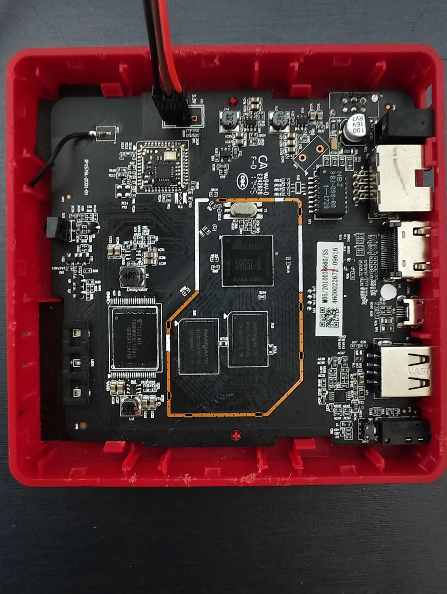
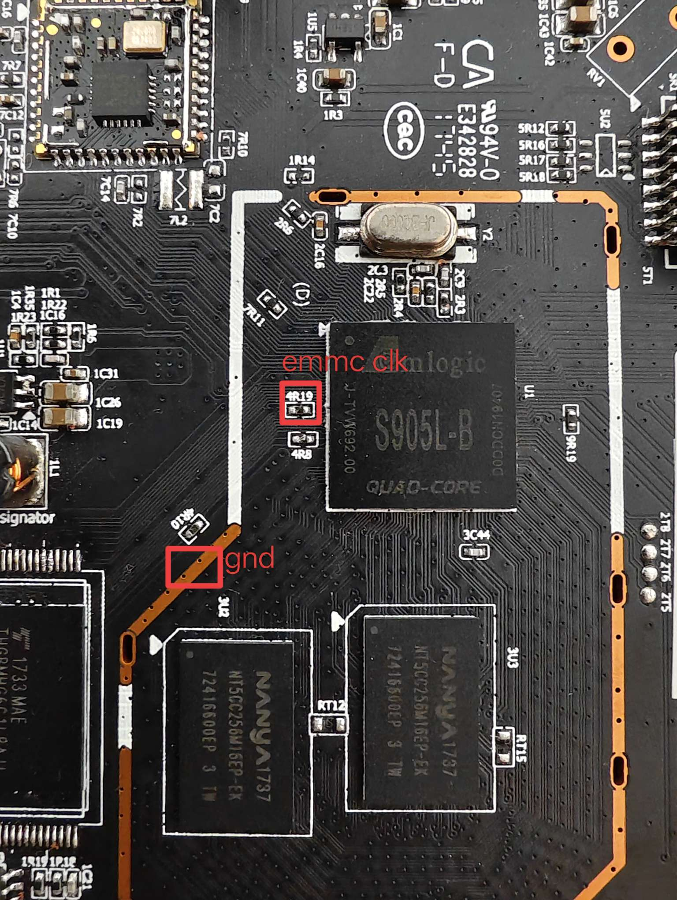

# 固件

[Armbian](https://github.com/armbian/community)

## 安装固件

### 方法一

在设备能启动且有root权限的情况下，将Releases界面提供的主线u-boot.bin刻录到eMMC上：

```
# 如果是安卓系统则改为/dev/block/mmcblkN
dd if=path-to-u-boot.bin of=/dev/mmcblkN bs=512 seek=1
```

如果设备不能启动或者没有root权限，可以参考其他博客刷入带root的安卓

刻录好主线u-boot.bin后，设备就有了SD卡/U盘/网络启动的能力

将固件镜像刻录到SD卡/U盘，插入设备开机即可

### 方法二（推荐）

将固件镜像刻录到SD卡，插入设备

短接eMMC然后上电，1s后松开eMMC短接（太晚则内核无法驱动eMMC）

由于上电时eMMC不可用，SoC就从SD卡加载U-Boot并启动固件

进入固件shell后，使用dd破坏eMMC上的U-Boot，这样下次启动就不需要短接eMMC了：

```
echo 0 | sudo tee /sys/block/mmcblk1boot0/force_ro
echo 0 | sudo tee /sys/block/mmcblk1boot1/force_ro

sudo dd if=/dev/zero of=/dev/mmcblk1boot0 bs=1MiB count=4 status=progress
sudo dd if=/dev/zero of=/dev/mmcblk1boot1 bs=1MiB count=4 status=progress

sudo dd if=/dev/zero of=/dev/mmcblk1 bs=1MiB count=4 status=progress
```

当然也可以将主线u-boot.bin刻录到eMMC上，这样就可以实现eMMC启动U-Boot，SD卡/U盘启动固件

### 固件写入到eMMC

只需要先从SD卡/U盘启动固件，再使用dd直接把固件的img刻录到eMMC即可

# 硬件

BesTV R3300-L

Amlogic S905L-B SoC

1 GB DDR，8 GB eMMC

一个USB 2.0 Type-A，一个USB 2.0 Micro USB OTG

SD卡槽

百兆网口和RTL8189FTV WiFi

HDMI和AV音视频输出



eMMC两边有TSOP48 NAND的焊盘，很容易定位NAND CE pin，根据S905X的数据手册，NAND_CE0和EMMC_CLK是同一个pin，所以可以用来短接eMMC

由于NAND焊盘密集不容易短接，用万用表蜂鸣档找到相连接的电阻点位，短接图中的电阻任意一边到GND即可让eMMC不工作



# 音频

该设备存在HDMI音频和Lineout音频（在3.5mm AV接口里面）输出，可通过amixer来配置

恢复到默认：

```
amixer -D hw:S905XP212 cset name='ACODEC Playback Volume' 255
amixer -D hw:S905XP212 cset name='ACODEC Left DAC Sel' 'Left'
amixer -D hw:S905XP212 cset name='ACODEC Mute Ramp Switch' off
amixer -D hw:S905XP212 cset name='ACODEC Playback Channel Mode' 'Stereo'
amixer -D hw:S905XP212 cset name='ACODEC Ramp Rate' 'Fast'
amixer -D hw:S905XP212 cset name='ACODEC Right DAC Sel' 'Right'
amixer -D hw:S905XP212 cset name='ACODEC Unmute Ramp Switch' off
amixer -D hw:S905XP212 cset name='ACODEC Volume Ramp Switch' off
amixer -D hw:S905XP212 cset name='AIU ACODEC I2S Lane Select' 0
amixer -D hw:S905XP212 cset name='AIU ACODEC OUT EN Switch' off
amixer -D hw:S905XP212 cset name='AIU ACODEC SRC' 'DISABLED'
amixer -D hw:S905XP212 cset name='AIU HDMI CTRL SRC' 'DISABLED'
amixer -D hw:S905XP212 cset name='AIU SPDIF SRC SEL' 'SPDIF'
```

打开HDMI输出：

```
amixer -D hw:S905XP212 cset name='AIU HDMI CTRL SRC' 'I2S'
```

打开Lineout输出：

```
amixer -D hw:S905XP212 cset name='AIU ACODEC SRC' 'I2S'
amixer -D hw:S905XP212 cset name='AIU ACODEC OUT EN Switch' on
amixer -D hw:S905XP212 cset name='ACODEC Playback Volume' 255
```

播放音乐：

```
mpv --audio-device='alsa/plughw:CARD=S905XP212,DEV=0' --no-video test.mp3
```

Armbian固件使用ALSA UCM来配置音频路由，所以不需要像上面手动设置

对于桌面环境，直接在设置App里面选择音频设备即可

对于CLI，执行`alsactl init && alsaucm set _verb "HiFi" set _enadev "HDMI"`或者`alsactl init && alsaucm set _verb "HiFi" set _enadev "Lineout"`即可

# CVBS

使用3.5mm AV转RCA线即可使用设备的CVBS和Lineout

> 一般来说，黄色RCA是视频，白色RCA是左声道，红色RCA是右声道
>
> 但是有些转接线的线序是是乱的，需要自己确认。例如一根根插到电视的视频输入确认哪根是视频输出
>
> 或者一根根插入功放并播放音乐看哪根没有音频输出，哪根就是视频输出

由于CVBS并没有类似DP HPD的机制，所以需要强制打开CVBS的输出，有两种办法

## 临时打开CVBS输出

```
root@bestv-r3300-l:~# cat /sys/class/drm/card0-Composite-1/status 
unknown
root@bestv-r3300-l:~# echo "on" | sudo tee /sys/class/drm/card0-Composite-1/status
on
root@bestv-r3300-l:~# cat /sys/class/drm/card0-Composite-1/status 
connected
```

## 永久打开CVBS输出

将`video=Composite-1:720x480@60ime,margin_top=10,margin_bottom=20,margin_left=5,margin_right=30`添加到内核参数中即可实现开机就打开CVBS输出

参数可自行调整，注意分辨率只有只有两种可能：

```
root@bestv-r3300-l:~# cat /sys/class/drm/card0-Composite-1/modes 
720x576i
720x480i
```

# IR

首先安装两个实用程序：

```
apt install ir-keytable evtest
```

通过ir-keytable查看rc设备：

```
root@bestv-r3300-l:~# ir-keytable 
Found /sys/class/rc/rc0/ with:
	Name: meson-ir
	Driver: meson-ir
	Default keymap: rc-empty
	Input device: /dev/input/event1
	LIRC device: /dev/lirc0
	Attached BPF protocols: Operation not supported
	Supported kernel protocols: lirc rc-5 rc-5-sz jvc sony nec sanyo mce_kbd rc-6 sharp xmp imon rc-mm 
	Enabled kernel protocols: lirc 
	bus: 25, vendor/product: 0000:0000, version: 0x0000
	Repeat delay: 500 ms, repeat period: 125 ms
```

`/dev/lirc0`输出原始红外脉冲宽度，`/dev/input/event1`是rc0对应的输入事件设备

分别执行`hexdump /dev/lirc0`和`hexdump /dev/input/event1`并按下遥控器按键，发现前者有数据输出而后者没有。因为需要设置正确的协议将原始红外脉冲宽度转换成扫描码

查看rc0支持的协议，当前默认使用lirc：

```
root@bestv-r3300-l:~# cat /sys/class/rc/rc0/protocols 
rc-5 nec rc-6 jvc sony rc-5-sz sanyo sharp mce_kbd xmp imon rc-mm [lirc]
```

测试使用的中国电信IPTV遥控器使用NEC协议，则：

```
echo nec > /sys/class/rc/rc0/protocols
```

然后再次执行`hexdump /dev/input/event1`并按下遥控器按键，便有数据输出了

可以通过`evtest /dev/input/event1`和`ir-keytable -s rc0 -t`获得对应按键的扫描码：

```
root@bestv-r3300-l:~# evtest /dev/input/event1
Input driver version is 1.0.1
Input device ID: bus 0x19 vendor 0x0 product 0x0 version 0x0
Input device name: "meson-ir"
Supported events:
  Event type 0 (EV_SYN)
  Event type 1 (EV_KEY)
  Event type 2 (EV_REL)
    Event code 0 (REL_X)
    Event code 1 (REL_Y)
  Event type 4 (EV_MSC)
    Event code 4 (MSC_SCAN)
Key repeat handling:
  Repeat type 20 (EV_REP)
    Repeat code 0 (REP_DELAY)
      Value    500
    Repeat code 1 (REP_PERIOD)
      Value    125
Properties:
  Property type 5 (INPUT_PROP_POINTING_STICK)
Testing ... (interrupt to exit)
Event: time 1761976717.612053, type 4 (EV_MSC), code 4 (MSC_SCAN), value b3ca
Event: time 1761976717.612053, -------------- SYN_REPORT ------------

root@bestv-r3300-l:~# ir-keytable -s rc0 -t
Testing events. Please, press CTRL-C to abort.
4534.972100: lirc protocol(nec): scancode = 0xb3ca
4534.972161: event type EV_MSC(0x04): scancode = 0xb3ca
4534.972161: event type EV_SYN(0x00).
```

在得到遥控器按键的扫描码后，可以将其映射成Linux标准输入事件键码。创建`/etc/rc_keymaps/ct.toml`，内容：

```
[[protocols]]
name = "ct"
protocol = "nec"
variant = "nec32" # 可选，视协议需要
[protocols.scancodes]
0xb3ca = "KEY_UP"
0xb3d2 = "KEY_DOWN"
0xb399 = "KEY_LEFT"
0xb3c1 = "KEY_RIGHT"
```

然后执行：

```
# 清除旧的映射表
ir-keytable -s rc0 -c
# 写入新建的映射表
ir-keytable -s rc0 -w /etc/rc_keymaps/ct.toml

# 也可以在/etc/rc_maps.cfg文件尾部增加一行* * ct.toml，让ir-keytable自动写入映射表，这种方式可以一次性处理多个映射表
ir-keytable -s rc0 -a /etc/rc_maps.cfg
```

建立映射表后再用`evtest /dev/input/event1`测试：

```
root@bestv-r3300-l:~# evtest /dev/input/event1
Input driver version is 1.0.1
Input device ID: bus 0x19 vendor 0x0 product 0x0 version 0x0
Input device name: "meson-ir"
Supported events:
  Event type 0 (EV_SYN)
  Event type 1 (EV_KEY)
    Event code 103 (KEY_UP)
    Event code 105 (KEY_LEFT)
    Event code 106 (KEY_RIGHT)
    Event code 108 (KEY_DOWN)
  Event type 2 (EV_REL)
    Event code 0 (REL_X)
    Event code 1 (REL_Y)
  Event type 4 (EV_MSC)
    Event code 4 (MSC_SCAN)
Key repeat handling:
  Repeat type 20 (EV_REP)
    Repeat code 0 (REP_DELAY)
      Value    500
    Repeat code 1 (REP_PERIOD)
      Value    125
Properties:
  Property type 5 (INPUT_PROP_POINTING_STICK)
Testing ... (interrupt to exit)
Event: time 1761977390.016092, type 4 (EV_MSC), code 4 (MSC_SCAN), value b3ca
Event: time 1761977390.016092, type 1 (EV_KEY), code 103 (KEY_UP), value 1
Event: time 1761977390.016092, -------------- SYN_REPORT ------------
Event: time 1761977390.147996, type 1 (EV_KEY), code 103 (KEY_UP), value 0
Event: time 1761977390.147996, -------------- SYN_REPORT ------------
Event: time 1761977391.863992, type 4 (EV_MSC), code 4 (MSC_SCAN), value b3d2
Event: time 1761977391.863992, type 1 (EV_KEY), code 108 (KEY_DOWN), value 1
Event: time 1761977391.863992, -------------- SYN_REPORT ------------
Event: time 1761977391.995964, type 1 (EV_KEY), code 108 (KEY_DOWN), value 0
Event: time 1761977391.995964, -------------- SYN_REPORT ------------
Event: time 1761977393.356046, type 4 (EV_MSC), code 4 (MSC_SCAN), value b399
Event: time 1761977393.356046, type 1 (EV_KEY), code 105 (KEY_LEFT), value 1
Event: time 1761977393.356046, -------------- SYN_REPORT ------------
Event: time 1761977393.487985, type 1 (EV_KEY), code 105 (KEY_LEFT), value 0
Event: time 1761977393.487985, -------------- SYN_REPORT ------------
Event: time 1761977394.560053, type 4 (EV_MSC), code 4 (MSC_SCAN), value b3c1
Event: time 1761977394.560053, type 1 (EV_KEY), code 106 (KEY_RIGHT), value 1
Event: time 1761977394.560053, -------------- SYN_REPORT ------------
Event: time 1761977394.691978, type 1 (EV_KEY), code 106 (KEY_RIGHT), value 0
Event: time 1761977394.691978, -------------- SYN_REPORT ------------
```

C代码读取遥控器按键：

```c
#include <fcntl.h>
#include <linux/input.h>
#include <stdio.h>
#include <stdlib.h>
#include <unistd.h>

int main(int argc, char *argv[]) {
  const char *device = "/dev/input/event1";
  int fd;
  struct input_event ev;

  fd = open(device, O_RDONLY);
  if (fd == -1) {
    perror("failed to open device");
    exit(-1);
  }

  while (1) {
    if (read(fd, &ev, sizeof(ev)) == sizeof(ev)) {
      if (ev.type == EV_MSC && ev.code == MSC_SCAN) {
        printf("扫描码: 0x%04x\n", ev.value);
      } else if (ev.type == EV_KEY) {
        printf("键码: %d, 值: %d (1=按下, 0=释放)\n", ev.code, ev.value);
      } else if (ev.type == EV_SYN) {
      }
    }
  }

  close(fd);

  return 0;
}
```

```
root@bestv-r3300-l:~# ./rc0-listen 
扫描码: 0xb3ca
键码: 103, 值: 1 (1=按下, 0=释放)
键码: 103, 值: 0 (1=按下, 0=释放)
扫描码: 0xb3d2
键码: 108, 值: 1 (1=按下, 0=释放)
键码: 108, 值: 0 (1=按下, 0=释放)
扫描码: 0xb399
键码: 105, 值: 1 (1=按下, 0=释放)
扫描码: 0xb399
键码: 105, 值: 0 (1=按下, 0=释放)
扫描码: 0xb3c1
键码: 106, 值: 1 (1=按下, 0=释放)
键码: 106, 值: 0 (1=按下, 0=释放)
```

# 相关链接

[U-Boot for Amlogic P212](https://github.com/u-boot/u-boot/blob/master/doc/board/amlogic/p212.rst)

[armbian-onecloud/.github/workflows/ci.yml](https://github.com/hzyitc/armbian-onecloud/blob/readme/.github/workflows/ci.yml)

[Composite Video problems on Bookworm Lite, vc4-kms-v3d, Pygame, SDL](https://forums.raspberrypi.com/viewtopic.php?t=383423)

[runcommand: add new 'kms' videomode utility](https://github.com/RetroPie/RetroPie-Setup/pull/3842#issuecomment-2007219761)
