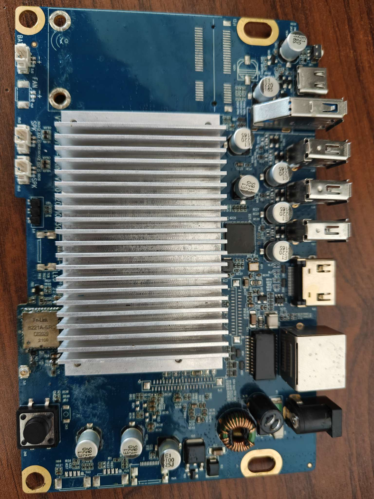
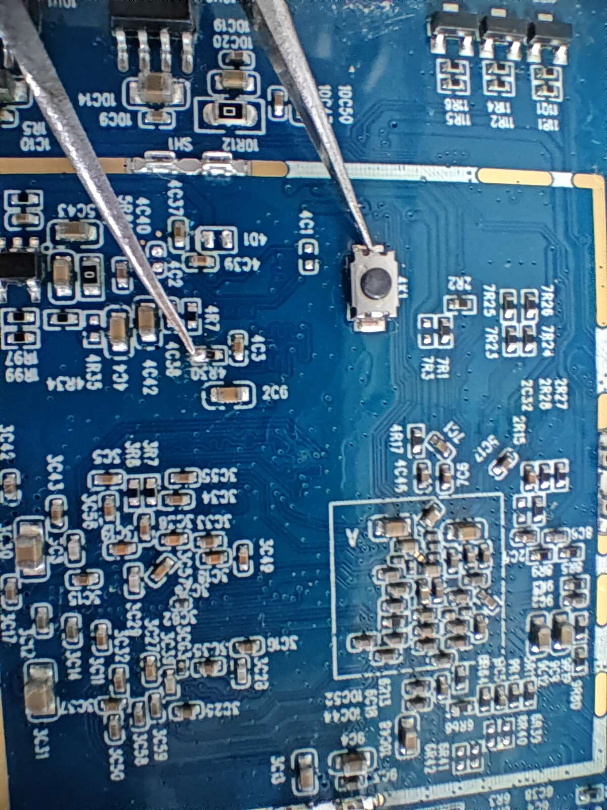

# 固件

[Armbian](https://github.com/retro98boy/armbian-build)

[Batocera](https://github.com/retro98boy/batocera.linux)

# 硬件

菜鸟物流LEMO小C，Amlogic A311D SoC，4 GB DDR，16 GB eMMC，三个USB 2.0 Type-A，一个USB 3.2 Gen1 Type-A，千兆网口和RTL8821CS WiFi/BT

一个USB Type-C用于在USB下载模式下传输数据

存在调试串口的焊孔，可以焊上2.54排针方便调试

eMMC短接点

# 主线U-Boot

在[retro98boy/armbian-build](https://github.com/retro98boy/armbian-build)仓库搜索cainiao-lemo-xiaoc即可找到添加该设备支持的U-Boot补丁

打上补丁后，使用`make cainiao-lemo-xiaoc_defconfig && make CROSS_COMPILE=aarch64-linux-gnu- -j$(nproc)`编译得到u-boot.bin

如何使用u-boot.bin制作FIP参考[此处](../cainiao-cniot-core/README.md)，需要的一些FIP blobs在[此处](https://github.com/retro98boy/amlogic-fip-blobs)下载

本仓库的[Releases界面](https://github.com/retro98boy/amlogic-devices/releases/tag/cainiao-lemo-xiaoc)有制作好的FIP，.bin文件用于直接刻录，.burn.img用于Amlogic USB Burning Tool线刷

# 主线内核

在[retro98boy/armbian-build](https://github.com/retro98boy/armbian-build)仓库搜索cainiao-lemo-xiaoc即可找到该设备的主线内核dts

## 外设工作情况

| Component             | Status                     |
|-----------------------|----------------------------|
| GBE                   | Working                    |
| WiFi                  | Working                    |
| BT                    | Working                    |
| eMMC                  | Working                    |
| USB                   | Working                    |
| HDMI Display          | Working                    |
| HDMI Audio            | Working                    |
| Internal Speaker      | Working                    |
| Power Button          | Working                    |
| ADC Key               | Working                    |

## 音频

和CAINIAO CNIoT-CORE一样，详见[此处](../cainiao-cniot-core/README.md)的**音频**章节。唯一不同的只是CNIoT-CORE为单个HT6872功放带动一个扬声器，LEMO小C两个HT6873带动两个扬声器

# 安装系统

参考[此处](../cainiao-cniot-core/README.md)的**安装系统**章节

# 救援系统

见[此处](../cainiao-cniot-core/README.md#救援系统)
