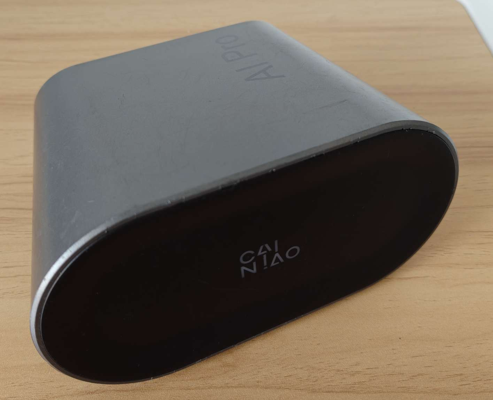
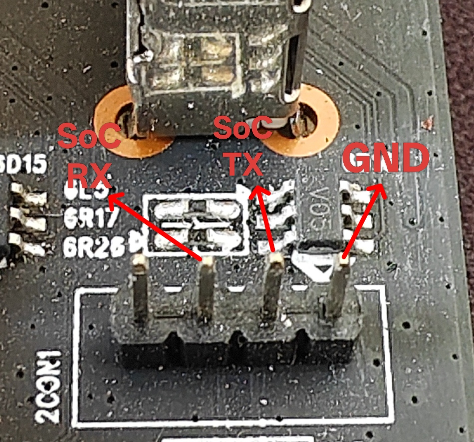

# 固件

[Armbian](https://github.com/retro98boy/armbian-build)

[Batocera](https://github.com/retro98boy/batocera.linux)

## 固件安装

注意：

该设备开启了安全启动，不要将该设备的固件写入到其他设备的eMMC

可以使用Amlogic HDMI boot dongle进入USB线刷模式，避免拆机

文中提到的一些资源可以在[Releases界面](https://github.com/retro98boy/amlogic-devices/releases/tag/cainiao-xiaoyi-pro)找到

### 从U盘启动系统

下载Armbian/Batocera镜像制作启动U盘待用

如果不需要保留eMMC上的安卓系统，直接用Amlogic Burn Tool v2.x.x将`cainiao-xiaoyi-pro-usbboot-retro98boy-20260404.burn.img`刷入设备。将启动U盘插入靠近RJ45的Type-A上再给设备上电并等待进入系统即可。后续启动U盘可以插在任意的Type-A上

如果需要保留eMMC上的安卓系统且愿意拆机，直接拆机用USB转串口模块将设备连接到电脑。给设备上电时，在串口终端中一直敲击空格停在U-Boot cmd界面。将启动U盘插入设备靠近RJ45的Type-A口。在U-Boot cmd中输入`run update`等待进入系统即可。后续启动U盘可以插在任意的Type-A上

如果需要保留eMMC上的安卓系统但不愿意拆机，则需要一台安装有Docker的Linux主机（X86/ARM64都可以），具体操作如下：

在Linux主机上使用`docker load < retro98boy-xiaoyi-pro-boot.tar`导入pyamlboot Docker镜像待用

设备断电，将Amlogic HDMI boot dongle插入HDMI

使用双公头Type-A连接设备和Linux主机，注意设备这端使用靠近RJ45的Type-A口

给设备上电

将DDR.USB上传到Linux主机，在DDR.USB同级目录依次执行下面的命令：

```
docker run -it --rm \
--network host \
--privileged \
-e LANG=zh_CN.UTF-8 \
-e SHELL=/bin/bash \
-e TERM=xterm-256color \
-e COLORTERM=truecolor \
-v /dev:/dev \
-v $(pwd):/data \
-v /etc/localtime:/etc/localtime:ro \
retro98boy/xiaoyi-pro-boot:latest \
boot-g12.py DDR.USB


docker run -it --rm \
--network host \
--privileged \
-e LANG=zh_CN.UTF-8 \
-e SHELL=/bin/bash \
-e TERM=xterm-256color \
-e COLORTERM=truecolor \
-v /dev:/dev \
-v $(pwd):/data \
-v /etc/localtime:/etc/localtime:ro \
retro98boy/xiaoyi-pro-boot:latest \
bulkcmd.py "disk_initial 0"

# 等待3s

docker run -it --rm \
--network host \
--privileged \
-e LANG=zh_CN.UTF-8 \
-e SHELL=/bin/bash \
-e TERM=xterm-256color \
-e COLORTERM=truecolor \
-v /dev:/dev \
-v $(pwd):/data \
-v /etc/localtime:/etc/localtime:ro \
retro98boy/xiaoyi-pro-boot:latest \
bulkcmd.py "setenv upgrade_step 3 && saveenv"
```

设备断电，拔掉刷机线和Amlogic HDMI boot dongle，将启动U盘插入设备上靠近RJ45的Type-A口

给设备上电，等待启动U盘上的系统即可

### 将系统写入eMMC（可选）

成功从U盘启动Armbian/Batocera后，只需要将Armbian/Batocera的镜像上传到U盘系统，再执行dd命令将镜像刻录到eMMC。dd完成后，关机拔掉U盘即可

## 固件使用

### 音频

和CAINIAO CNIoT-CORE一样，详见[此处](../cainiao-cniot-core/README.md)的**音频**章节

### RGB灯光

通过控制RBG通道的分量来合成任何颜色，例如棕色的RGB Hex是`#A52A2A`，十进制是165 42 42，则：

```
# 设置分量
echo 165 42 42 > /sys/class/leds/rgb\:indicator/multi_intensity
# 设置亮度
echo 255 > /sys/class/leds/rgb\:indicator/brightness
```

# 刷回原厂安卓系统

直接线刷`cainiao-xiaoyi-pro-stock-android9-dump-retro98boy-20260404.repack.burn.img`即可

该线刷包基于eMMC全盘备份重新打包。bootloader使用eMMC boot area上的。aml mem dtb是从reserved分区中提取出来的，使用`unpack_bootimg`从boot.img中提取出来的版本(second)验签不通过

```
dd if=emmc-bootN-dump.img of=aml_sdc_burn.UBOOT bs=512 skip=0 count=4096
dd if=emmc-bootN-dump.img of=DDR.USB bs=512 skip=1 count=4096
dd if=reserved.PARTITION of=_aml_dtb.PARTITION bs=512 skip=8192 count=512
```

# 硬件



菜鸟物流小驿工作台Pro（小Yi Pro/CN1-PRO/AI PRO），Amlogic A311D SoC，4 GB DDR，32 GB eMMC，三个USB 2.0 Type-A，千兆网口和RTL8822CS WiFi/BT

靠近RJ45的USB Type-A用于线刷，推荐使用Amlogic HDMI boot dongle进入线刷模式

调试串口：


