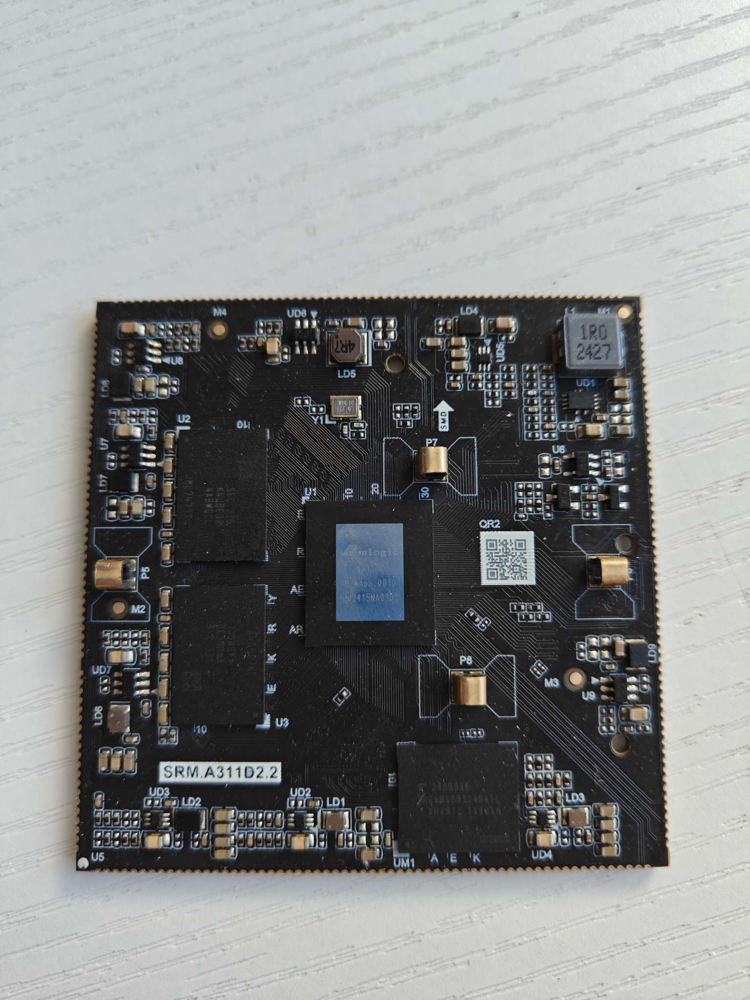
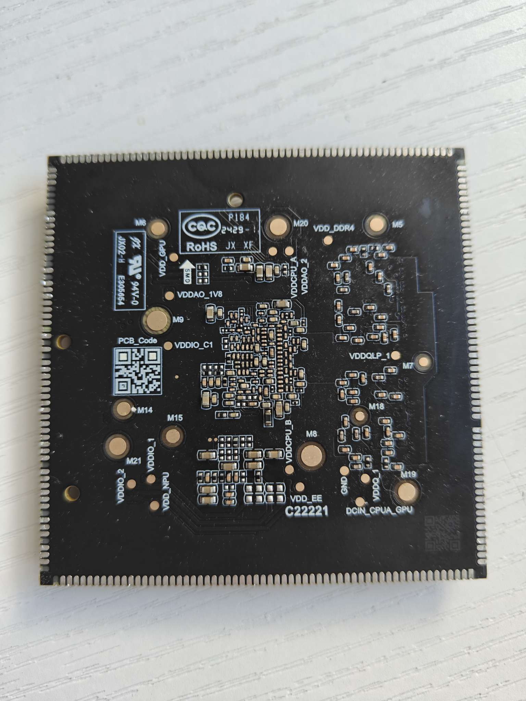

# 固件

[Armbian](https://github.com/retro98boy/armbian-build)

# 硬件

## 核心板






短接上图绿圈两点再上电会进入USB下载模式

短接上图红圈的电容两边会让eMMC无法工作。所以先短接，再上电，BootROM会跳过eMMC，直接从其他设备例如SD卡启动bootloader。但是和之前的SoC例如A311D不同，不会fallback到USB下载模式。要使用USB下载，还是得短接上图绿圈中的点。注意，如果没有特殊需求，尽量不要短接eMMC，不确定该操作是否安全

蓝圈里面是eMMC cmd上拉电阻

# 内核

暂时只能使用供应商内核，最新版本是5.15。dts在[此处](https://github.com/retro98boy/khadas-common-drivers/blob/khadas-vims-5.15.y/arch/arm64/boot/dts/amlogic/t7-a311d2-tvpro-8g.dts)

## 音频

个人对5.15供应商内核的音频配置理解在[此处](../../platforms/a311d2/audio/README.md)

对于上文的dts，HDMITX、LINE IN、LINE OUT可以使用

测试HDMITX：

```
amixer -D hw:corelabtvpro cset name='HDMITX Audio Source Select' 'Spdif'
aplay -D plughw:corelabtvpro,0 /usr/share/sounds/alsa/Front_Right.wav
```

测试LINE OUT：

```
amixer -D hw:corelabtvpro cset name='tdmout_c binv set' '0'
# 线性音量调整
amixer -D hw:corelabtvpro cset name='DAC Digital Playback Volume' 255
# 如果最大音量还不够，增益可以调的更大
amixer -D hw:corelabtvpro cset name='DAC Extra Digital Gain' '0dB'
amixer -D hw:corelabtvpro cset name='DAC SOURCE SELECT' 'Lane0'
aplay -D plughw:corelabtvpro,3 /usr/share/sounds/alsa/Front_Right.wav
```

测试LINE IN：

```
amixer -D hw:corelabtvpro cset name='Linein left switch' AIL1
amixer -D hw:corelabtvpro cset name='Linein right switch' AIR1
# 输入增益可调整，最大31
amixer -D hw:corelabtvpro cset name='PGA IN Gain' 31
arecord -D hw:corelabtvpro,3 -c 2 -f S16_LE -r 48000 linein.wav
aplay -D plughw:corelabtvpro,3 linein.wav
```

推荐使用ALSA UCM来配置控件，PipeWire/Pulse Audio会解析配置文件，这样在桌面环境下可以手动选择输出设备和录制设备

[这里](https://github.com/retro98boy/armbian-build/tree/main/packages/bsp/corelab-tvpro)存在对应的ALSA UCM配置文件，下载后执行安装命令：

```
mkdir -p /usr/share/alsa/ucm2/Amlogic/corelab-tvpro
cp corelab-tvpro* /usr/share/alsa/ucm2/Amlogic/corelab-tvpro

mkdir /usr/share/alsa/ucm2/conf.d/corelab-tvpro
ln -sfv /usr/share/alsa/ucm2/Amlogic/corelab-tvpro/corelab-tvpro.conf /usr/share/alsa/ucm2/conf.d/corelab-tvpro/corelab-tvpro.conf
```

安装完成后重启设备即可

不安装桌面环境，直接在CLI下使用ALSA UCM也是可以的，执行`alsactl init && alsaucm set _verb "HiFi" set _enadev "HDMI" set _enadev "LINE OUT"`就会配置对应输出设备的控件

## GPU

供应商内核GPU驱动使用ARM私有blob，对于开源软件的兼容性并不好。好在可以改用Panfrost内核驱动加Mesa库。需要修改dts和内核配置，可以参考[此处](https://github.com/retro98boy/armbian-build/commit/18291b0f467b6a5d967a2b6cacb602c386c1cb52)
