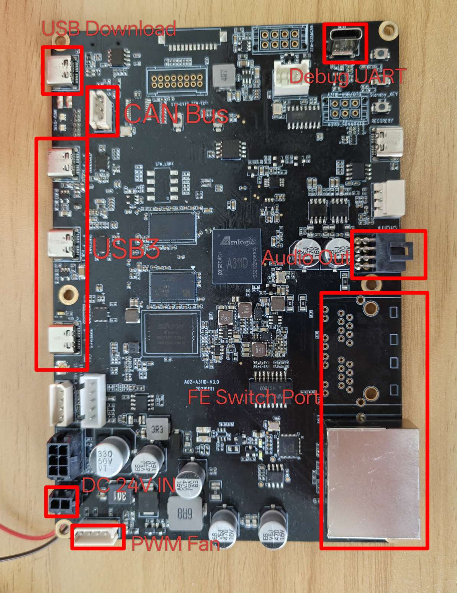
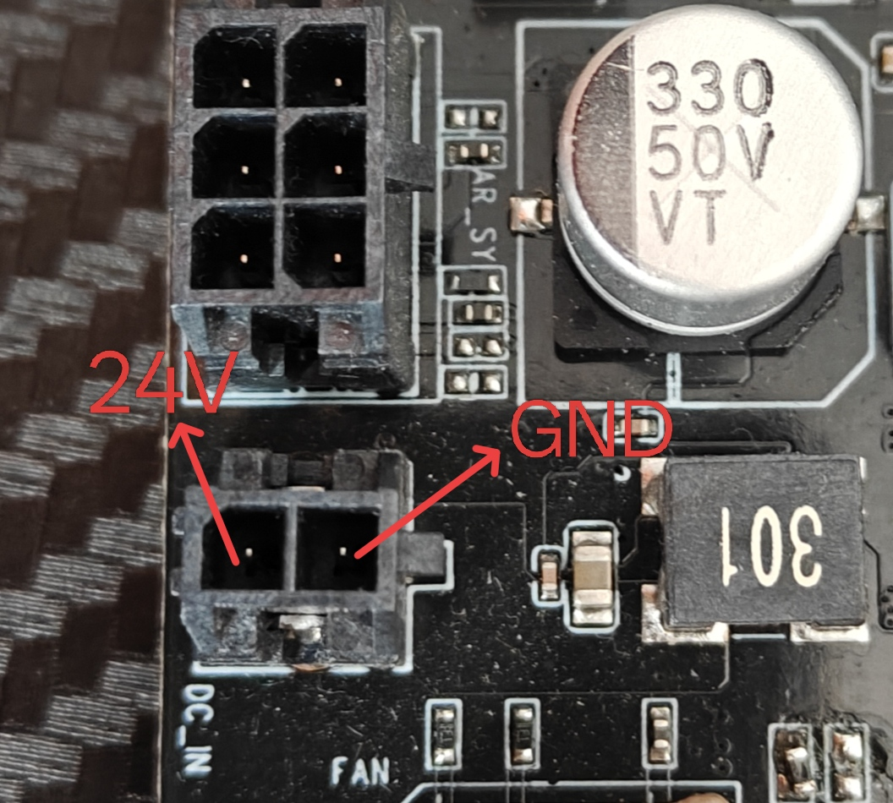
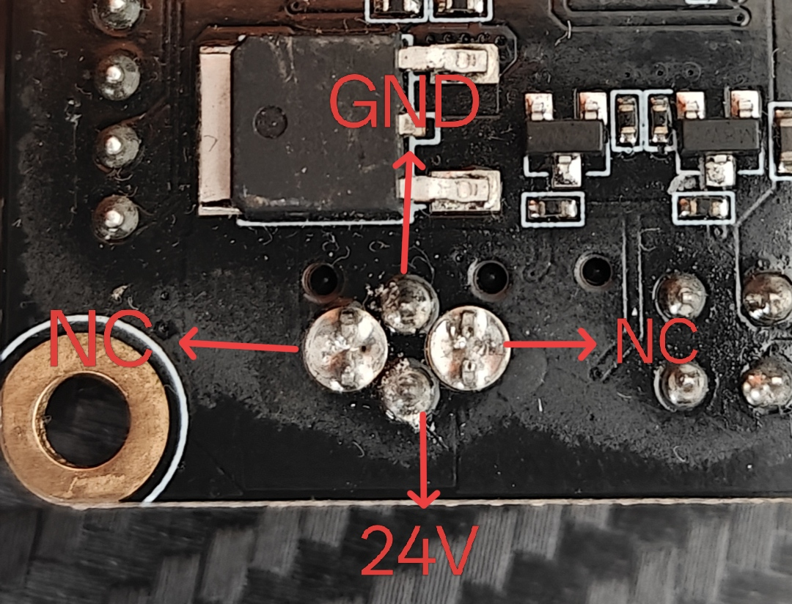
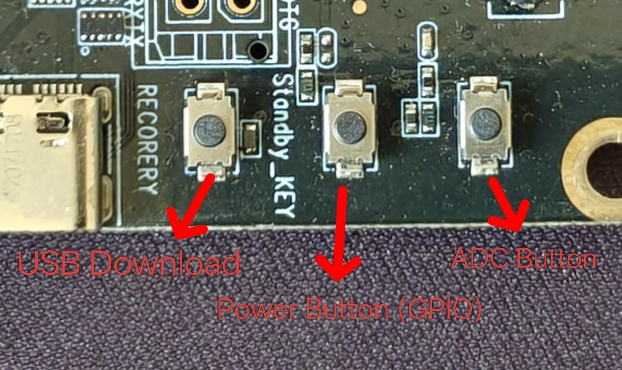
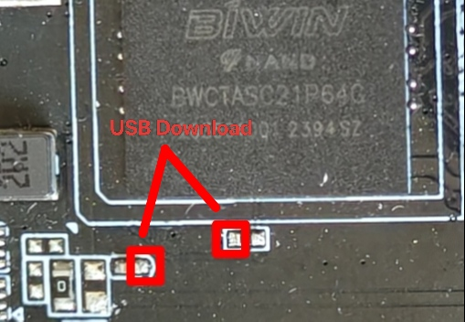
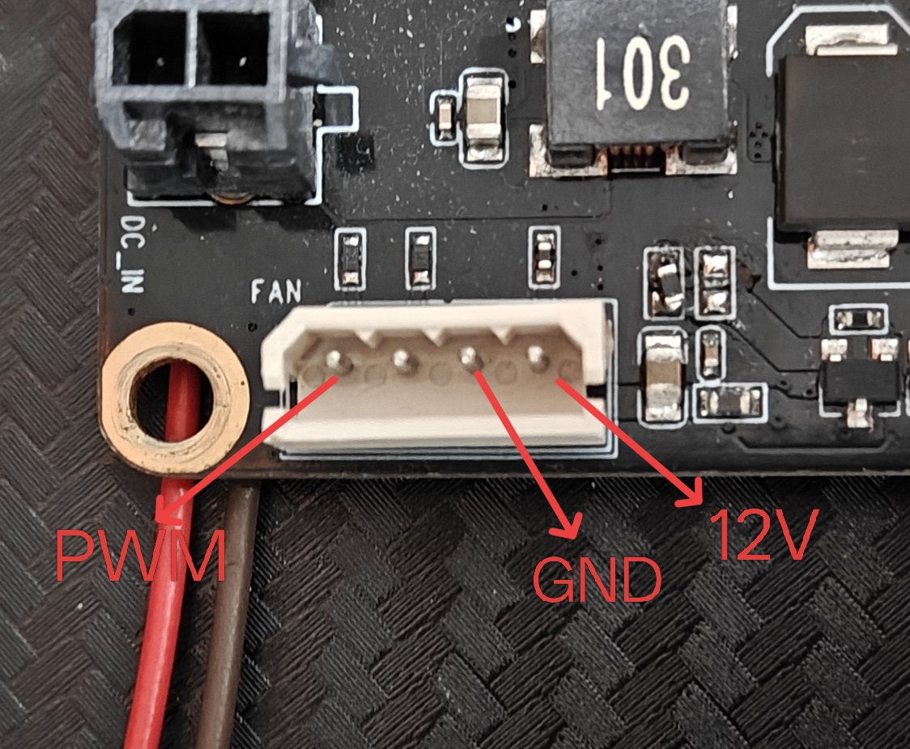
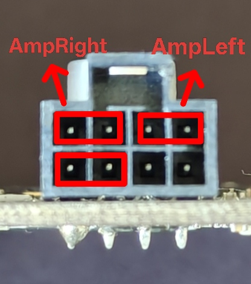
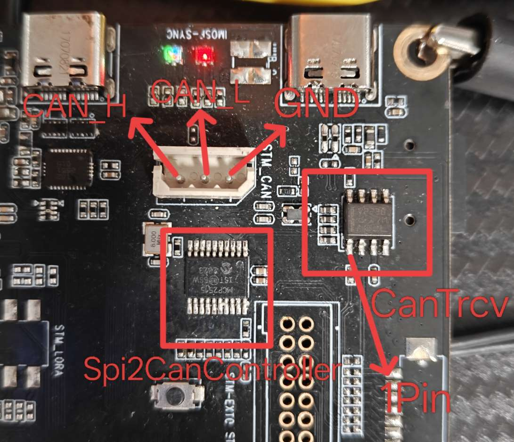

# 固件

[Armbian](https://github.com/retro98boy/armbian-build)

## 固件安装

注意：

文中提到的一些资源可以在[Releases界面](https://github.com/retro98boy/amlogic-devices/releases/tag/goodmobi-a02)找到

### 从U盘启动系统

用USB A2C线连接PC和设备的USB Download口，按住RECOVERY按键再给设备上电

用Amlogic Burn Tool v2.x.x将fip-with-mainline-uboot.burn.img刷入eMMC并断电

通过OTG线将制作好的Armbian U盘插入设备的USB3口

给设备上电等待即可

### 将系统写入eMMC（可选）

成功从U盘启动Armbian后，只需要将Armbian的镜像上传到U盘系统，再执行dd命令将镜像刻录到eMMC。dd完成后，关机拔掉U盘即可

或者也可以使用`armbian-install`命令

## 固件使用

### 音频

和CAINIAO CNIoT-CORE一样，详见[此处](../cainiao-cniot-core/README.md)的**音频**章节

# 硬件

未知的A311D设备，暂且叫GOODMOBI A02，Amlogic A311D SoC，4 GB DDR，64 GB eMMC，三个USB 3.0 Type-C，一个5口百兆以太网交换机，一路CAN总线，一路立体声功放接口

带USB Boot按键，线刷很方便。自带USB转UART电路，调试也很方便

使用24V供电，接口如下：

或者从背面焊接线：

按键，按住RECOVERY按键再给设备上电可以进入线刷模式：

短接下面的触点和按住RECOVERY按键相同的作用：

PWM调速风扇：

立体声功放接口：

CAN总线接口：

