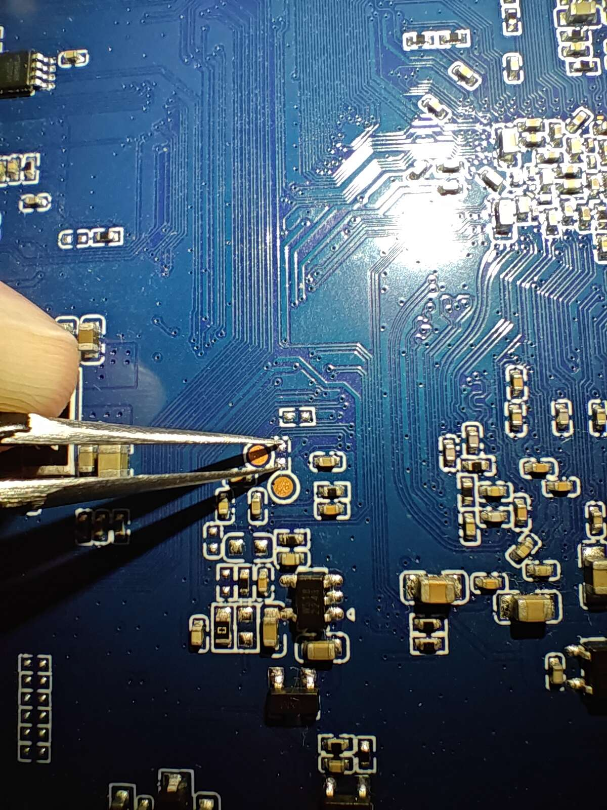

# 固件

## 固件使用

# 硬件

亮钻K-A311D，Amlogic A311D SoC，4 GB DDR，32 GB eMMC，一个USB 2.0 Type-A，一个USB 3.2 Gen1 Type-A，千兆网口和AP6255 WiFi/BT

http://www.liontron.cn/showinfo-118-217-0.html

http://en.liontron.cn/showinfo-118-218-0.html

eMMC短接点



Micro USB用于在USB下载模式下传输数据

主板上的USB 2.0 Type-A为USB 2.0 Hub芯片扩展而来，而Hub芯片和主板上的Micro USB复用同一USB 2.0信号

USB信号复用芯片在Micro USB的上方，有4221的丝印。搜索4221 switch chip找到名为BCT4221A的芯片手册，量了下引脚，基本确定是该芯片。在该板子上，BCT4221A的使能引脚被短接到GND，即一直使能输出。只要切换S引脚的高低电平就能在Type-A和Micro USB之间切换输出。不去控制S引脚，USB信号默认连接到Micro USB

# 开发区域

## 音频路由

```
# 恢复默认
## A311D part
amixer -D hw:ka311d cset name='FRDDR_A SINK 1 SEL' 'OUT 0'
amixer -D hw:ka311d cset name='FRDDR_A SINK 2 SEL' 'OUT 0'
amixer -D hw:ka311d cset name='FRDDR_A SINK 3 SEL' 'OUT 0'
amixer -D hw:ka311d cset name='FRDDR_A SRC 1 EN Switch' off
amixer -D hw:ka311d cset name='FRDDR_A SRC 2 EN Switch' off
amixer -D hw:ka311d cset name='FRDDR_A SRC 3 EN Switch' off
amixer -D hw:ka311d cset name='FRDDR_B SINK 1 SEL' 'OUT 0'
amixer -D hw:ka311d cset name='FRDDR_B SINK 2 SEL' 'OUT 0'
amixer -D hw:ka311d cset name='FRDDR_B SINK 3 SEL' 'OUT 0'
amixer -D hw:ka311d cset name='FRDDR_B SRC 1 EN Switch' off
amixer -D hw:ka311d cset name='FRDDR_B SRC 2 EN Switch' off
amixer -D hw:ka311d cset name='FRDDR_B SRC 3 EN Switch' off
amixer -D hw:ka311d cset name='FRDDR_C SINK 1 SEL' 'OUT 0'
amixer -D hw:ka311d cset name='FRDDR_C SINK 2 SEL' 'OUT 0'
amixer -D hw:ka311d cset name='FRDDR_C SINK 3 SEL' 'OUT 0'
amixer -D hw:ka311d cset name='FRDDR_C SRC 1 EN Switch' off
amixer -D hw:ka311d cset name='FRDDR_C SRC 2 EN Switch' off
amixer -D hw:ka311d cset name='FRDDR_C SRC 3 EN Switch' off
amixer -D hw:ka311d cset name='TDMOUT_A Gain Enable Switch' off
amixer -D hw:ka311d cset name='TDMOUT_A Lane 0 Volume' 0
amixer -D hw:ka311d cset name='TDMOUT_A Lane 1 Volume' 0
amixer -D hw:ka311d cset name='TDMOUT_A Lane 2 Volume' 0
amixer -D hw:ka311d cset name='TDMOUT_A Lane 3 Volume' 0
amixer -D hw:ka311d cset name='TDMOUT_A SRC SEL' 'IN 0'
amixer -D hw:ka311d cset name='TDMOUT_B Gain Enable Switch' off
amixer -D hw:ka311d cset name='TDMOUT_B Lane 0 Volume' 0
amixer -D hw:ka311d cset name='TDMOUT_B Lane 1 Volume' 0
amixer -D hw:ka311d cset name='TDMOUT_B Lane 2 Volume' 0
amixer -D hw:ka311d cset name='TDMOUT_B Lane 3 Volume' 0
amixer -D hw:ka311d cset name='TDMOUT_B SRC SEL' 'IN 0'
amixer -D hw:ka311d cset name='TOHDMITX Switch' off
amixer -D hw:ka311d cset name='TOHDMITX I2S SRC' 'I2S A'
amixer -D hw:ka311d cset name='TOHDMITX SPDIF SRC' 'SPDIF A'

## ES8388 part
amixer -D hw:ka311d cset name='PCM Volume' 192
amixer -D hw:ka311d cset name='Mic PGA Volume' 8
amixer -D hw:ka311d cset name='Capture Digital Volume' 192
amixer -D hw:ka311d cset name='Capture Polarity' 'Normal'
amixer -D hw:ka311d cset name='Capture ZC Switch' off
amixer -D hw:ka311d cset name='DAC Deemphasis Switch' off
amixer -D hw:ka311d cset name='Differential Mux' 'Line 1'
amixer -D hw:ka311d cset name='Left Line Mux' 'Line 1'
amixer -D hw:ka311d cset name='Left Mixer Right Playback Switch' off
amixer -D hw:ka311d cset name='Left Mixer Left Bypass Volume' 0
amixer -D hw:ka311d cset name='Left Mixer Left Bypass Switch' off
amixer -D hw:ka311d cset name='Left Mixer Right Bypass Volume' 0
amixer -D hw:ka311d cset name='Left Mixer Right Bypass Switch' off
amixer -D hw:ka311d cset name='Left PGA Mux' 'Line 1'
amixer -D hw:ka311d cset name='Right Line Mux' 'Line 1'
amixer -D hw:ka311d cset name='Right Mixer Left Playback Switch' off
amixer -D hw:ka311d cset name='Right Mixer Left Bypass Volume' 0
amixer -D hw:ka311d cset name='Right Mixer Left Bypass Switch' off
amixer -D hw:ka311d cset name='Right Mixer Right Bypass Volume' 0
amixer -D hw:ka311d cset name='Right Mixer Right Bypass Switch' off
amixer -D hw:ka311d cset name='Right PGA Mux' 'Line 1'
amixer -D hw:ka311d cset name='Route' 'Stereo'
amixer -D hw:ka311d cset name='Output 1 Playback Volume' 36
amixer -D hw:ka311d cset name='Output 2 Playback Volume' 36


# FRDDR_A -> TDMOUT_A -> TOHDMITX -> HDMI
amixer -D hw:ka311d cset name='FRDDR_A SINK 1 SEL' 'OUT 0'
amixer -D hw:ka311d cset name='FRDDR_A SRC 1 EN Switch' on
amixer -D hw:ka311d cset name='TDMOUT_A SRC SEL' 'IN 0'
amixer -D hw:ka311d cset name='TOHDMITX Switch' on
amixer -D hw:ka311d cset name='TOHDMITX I2S SRC' 'I2S A'


# FRDDR_B -> TDMOUT_B -> ES8388 -> Speaker Amplifier
amixer -D hw:ka311d cset name='FRDDR_B SINK 1 SEL' 'OUT 1'
amixer -D hw:ka311d cset name='FRDDR_B SRC 1 EN Switch' on
amixer -D hw:ka311d cset name='TDMOUT_B SRC SEL' 'IN 1'
```

## PHY LED

该设备的RJ45接口上有两个LED，左边的黄灯（LED1），右边的绿灯（LED2）

可以使用[wkz/phytool](https://github.com/wkz/phytool)工具在用户空间来测试LED：

```
# 强制LED2常亮
phytool write end0/0/0x1e 0xb7 && phytool write end0/0/0x1f 0xe028

# 强制LED1常亮
phytool write end0/0/0x1e 0xb7 && phytool write end0/0/0x1f 0xe005

# 读出LED1的默认配置
phytool read end0/0/0x1f
0x0670

# LED1平时熄灭，有TX/RX流量时闪烁
phytool write end0/0/0x1e 0xb8 && phytool write end0/0/0x1f 0x2600

# 10/100/1000Mbps link时LED2常亮
phytool write end0/0/0x1e 0xb9 && phytool write end0/0/0x1f 0x0070
```

TODO: 在内核中完成PHY LED的配置
