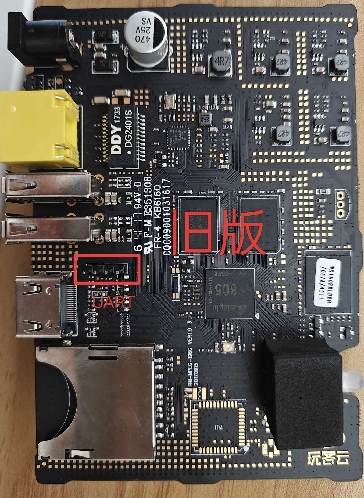
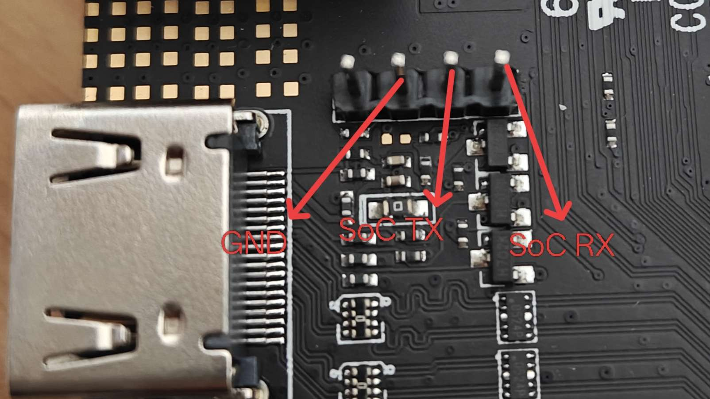
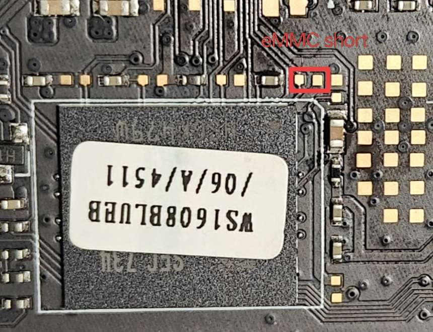
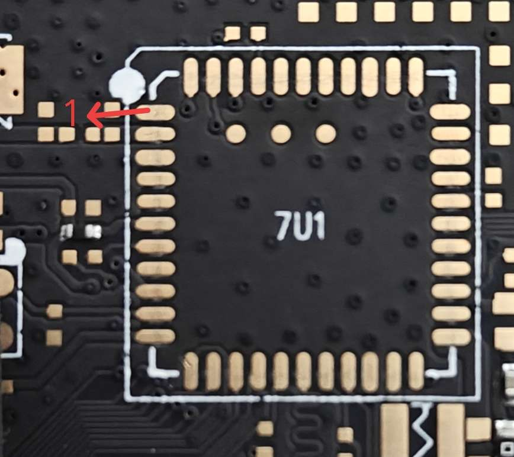

# 固件

[Armbian](https://github.com/hzyitc/armbian-onecloud)

[One-KVM](https://github.com/mofeng-git/One-KVM)

# 旧版硬件

| pin | def |
| --- | --- |
| 1  | gnd |
| 3  | gnd |
| 12 | gpiochip0 11 |
| 13 | gpiochip0 17 |
| 14 | gpiochip0 2 |
| 15 | gpiochip0 3 |
| 16 | gpiochip0 9 |
| 18 | gpiochip0 0 |
| 19 | gpiochip0 1 |
| 20 | gnd |
| 25 | gpiochip0 5 |
| 26 | gpiochip0 7 |
| 27 | gpiochip0 4 |
| 28 | gpiochip0 6 |
| 31 | gnd |
| 33 | gnd |
| 36 | gnd |
| 42 | gpiochip0 13 |
| 43 | gpiochip0 12 |
| 44 | gpiochip0 15 |

# 相关链接

[One-KVM 文档](https://docs.one-kvm.cn/python/start_install/onecloud_install/)
