以下为个人理解，不一定正确。基于5.15供应商内核

# 音频子系统框架图

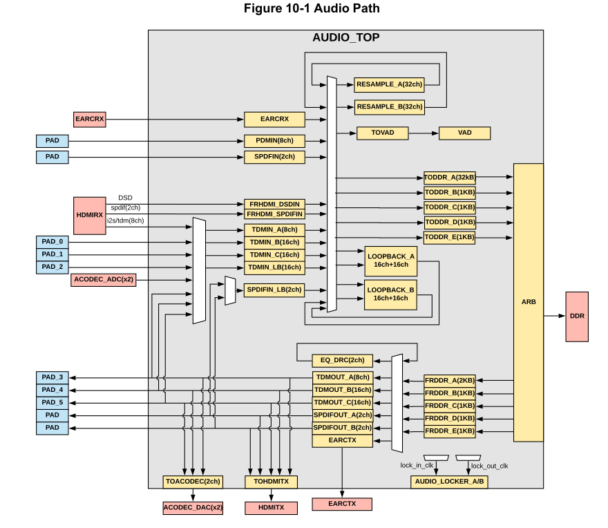

# 如何配置

A311D的主线内核驱动，将音频子系统注册成一个card，将FRDDR/TODDR注册成device，各个模块的数据流转通过dts和ALSA控件控制。在播放/录制音频时，只需要指定特定的device（即指定的FRDDR/TODDR）即可。整个数据流从起点到终点的配置和使用非常易于理解。[这里](../../../devices/cainiao-cniot-core/README.md#音频)存在详细的示例

对于A311D2供应商内核，整个音频子系统被注册成一个card，而在dts里面申明的DAI link都被注册成这个card的device。这样在尝试播放音频的时候，用户如何指定数据的起点呢（哪个FRDDR）？供应商内核的做法是：用户不需要关注数据的起点，只需要关注模块如何路由数据即可。例如用户在应用层指定某个device播放音频，驱动会自动为这个device对应的TDMOUT/SPDIFOUT模块寻找空闲的FRDDR使用，并将TDMOUT/SPDIF模块的src配置成这个FRDDR。而A311D2有5个FRDDR，所以最多可以同时输出5条不同的音频流。如果想要更多的音频流（可以相同），可以设置samesource，即一个FRDDR同时输出到多个模块。TODDR同理

以下是相关的驱动代码：

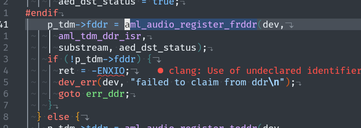

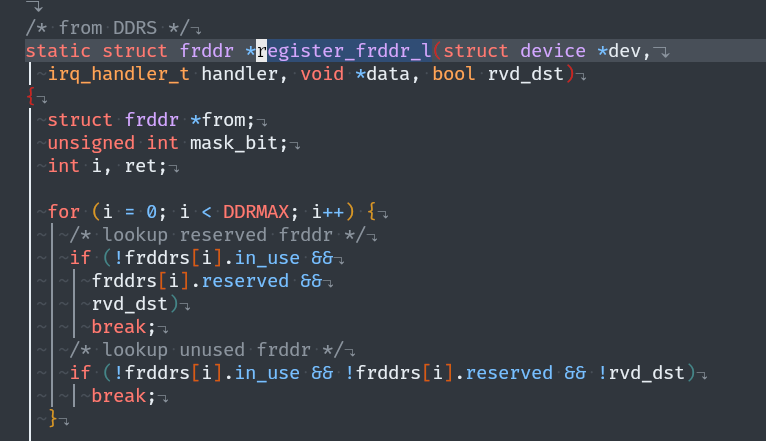

主要配置三个地方：

- 声明DAI link，这部分的结构和属性符合主线内核标准

- 配置TDM/SPDIF这些模块，这部分是供应商实现的，需要关注一些自定义的属性

- 配置TDM/SPDIF这些模块的引脚复用，如果数据只在模块内部流转，并不连接到外部pad，可以不配置

## 配置DAI Link

在申明DAI link时，如果SoC为从（例如mclk、lrclk等由外部codec提供），则可以这样写：

```
aml-audio-card,dai-link@0 {
	......
	/* master mode */
	/* bitclock-master = <&tdmb>; */
	/* frame-master = <&tdmb>; */
	
	/* slave mode */
	bitclock-master = <&tdmbcodec>;
	frame-master = <&tdmbcodec>;
	
	cpu {
		sound-dai = <&tdmb>;
		......
	};
	
	tdmbcodec: codec {
		sound-dai = <&es8388>;
	};
};
```

参考板dts的DAI link中还存在suffix-name属性，这个用于Android HAL，对于Linux用户可删除

## 配置TDM

在`common_drivers/sound/soc/amlogic/auge/tdm_match_table.h`下可以看到TDM模块的一些参数，例如T7平台每个TDM最大只有4个lane（数据手册中好像体现出有8个lane）？

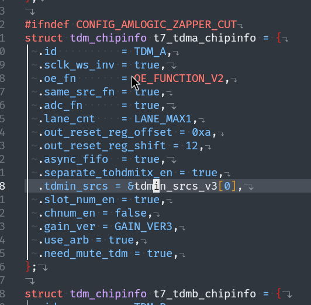

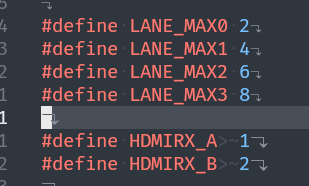

从Figure 10-5和Figure 10-10可以看出，无论是TDMIN还是TDMOUT，一个lane上只有两个channel

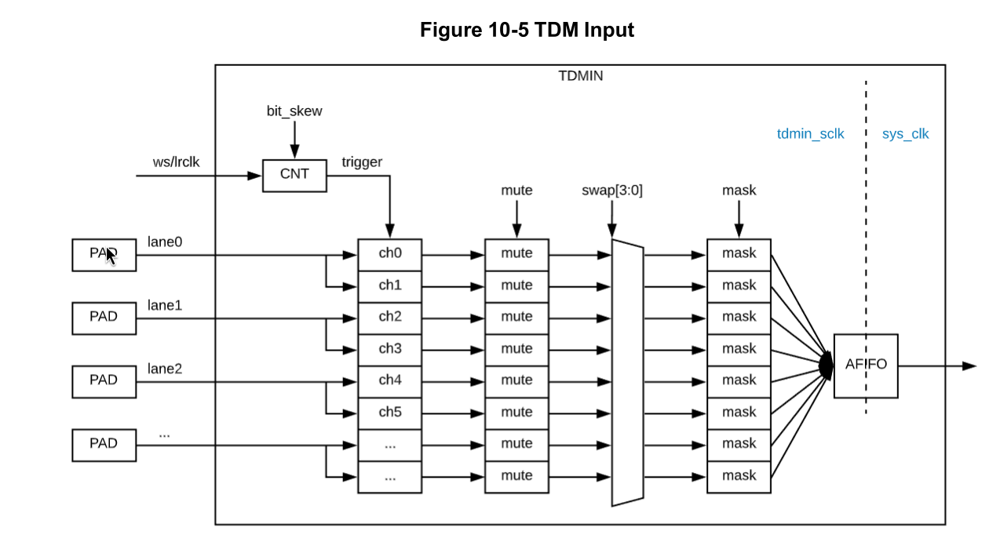

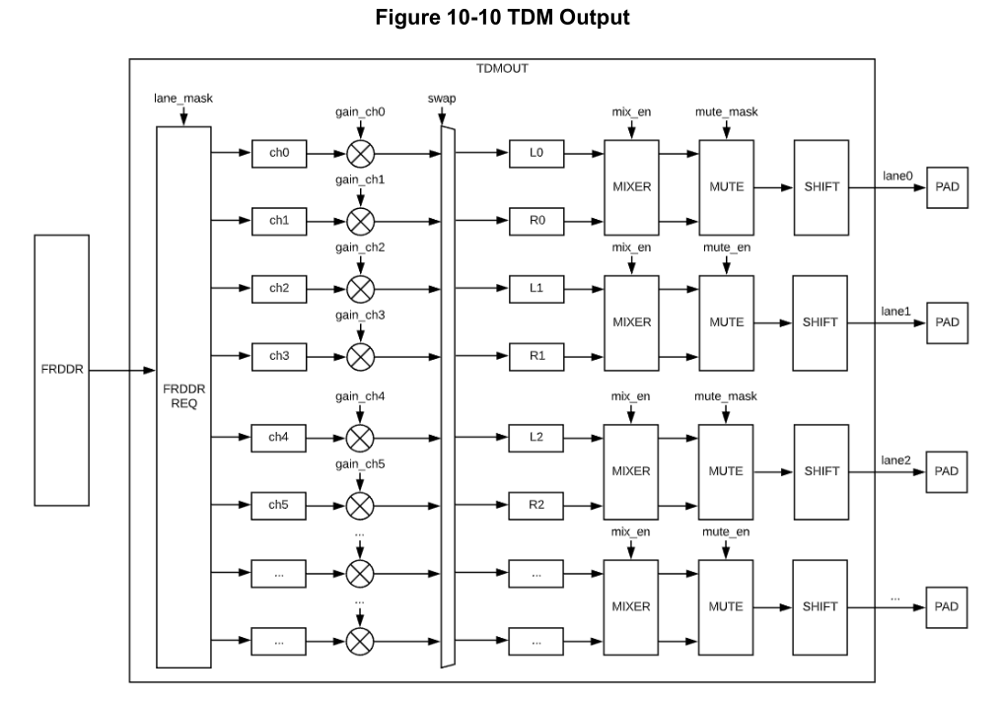

官方的参考板dts注释也可以验证这点

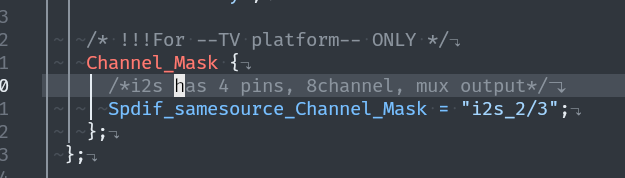

在dts中，一个TDM节点既配置了TDMOUT，也配置了TDMIN。下面是一些常用的属性

start_clk_enable：控制是否在codec启动前就打开TDM的mclk输出

samesource_sel：配置该TDM和哪个模块使用同一个FRDDR，ID表在下图

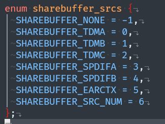

tdmin-src-name：配置该TDMIN的音频输入来源，可用的选项在下图

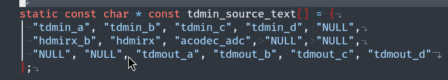

ctrl_gain：控制是否打该TDM的数字增益控制，打开则可以通过amixer/alsamixer配置增益

clk_tuning_enable：控制是否打开该TDM的时钟调优，打开则可以通过amxier/alsamixer调整时钟

i2s2hdmi：？？？

```
Channel_Mask {
	Spdif_samesource_Channel_Mask = "i2s_0/1";
};
```

针对上面的dts子节点，驱动代码有如下处理。好像是用于TDMOUT和SPDIFOUT使用同一个FRDDR时，只生效于指定的TDM lane？i2s_0/1代表lane 0

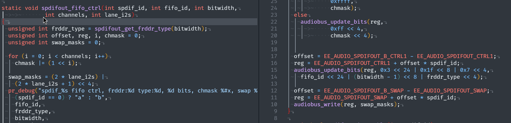

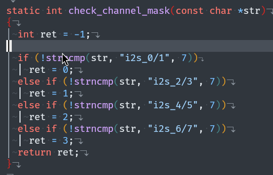

## 配置SPDIF

clk_tuning_enable：控制是否打开该SPDIF的时钟调优，打开则可以通过amxier/alsamixer配置时钟

## 配置ACODEC

ACODEC只能选择TDM作为音频输入/输出

```
&acodec {
	tdmout_index = <2>;
	tdmin_index = <2>;
	dat0_ch_sel = <0>;
};
```

TDM A/B/C的索引分别是0/1/2

dat0_ch_sel用于选择TOACODEC的i2s_in0的TDM lane，dat1_ch_sel用于选择TOACODEC的i2s_in0的TDM lane

对于A311D2，在mesont7.dtsi的acodec节点中，存在属性lane_offset，其值应为8，因为每跳过8个lane，就换了一个TDM

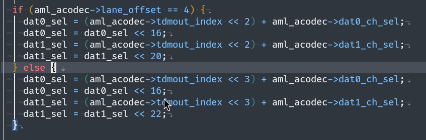

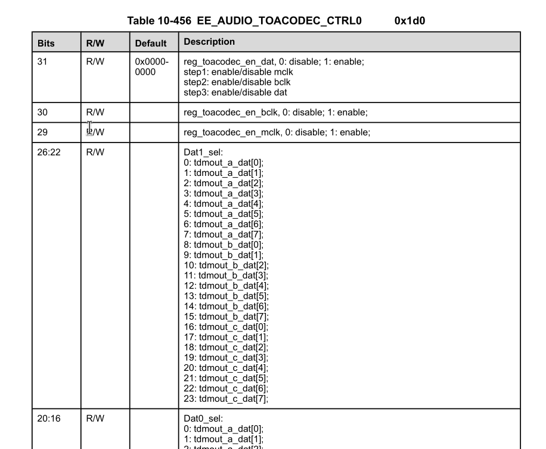

假如ACODEC的输入和输出都选择了TDMC，且DAI link index为3，则可以用以下命令测试模拟输入和输出：

```
# 播放音频
amixer -D hw:0 cset name='tdmout_c binv set' '0'
amixer -D hw:0 cset name='DAC Digital Playback Volume' 255
# 增益可以调的更大
amixer -D hw:0 cset name='DAC Extra Digital Gain' '0dB'
amixer -D hw:0 cset name='DAC SOURCE SELECT' 'Lane0'
aplay -D plughw:0,3 /usr/share/sounds/alsa/Front_Right.wav

# 录制音频并播放
amixer -D hw:0 cset name='Linein left switch' AIL1
amixer -D hw:0 cset name='Linein right switch' AIR1
amixer -D hw:0 cset name='PGA IN Gain' 31
arecord -D hw:0,3 -c 2 -f S16_LE -r 48000 linein.wav
aplay -D plughw:0,3 linein.wav
```

## 配置AED

AED全称为Audio EQDRC，可以对播放的音频进行预处理

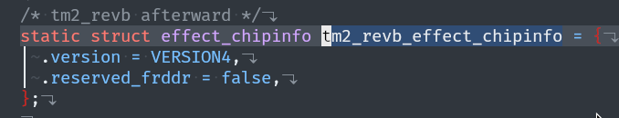

从驱动代码中可以看到，A311D2的AED使用不需要单独占用一个FRDDR

选择AED对哪个模块生效，可以通过eqdrc_module属性，枚举表如下：

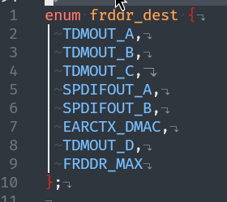

通过下面的驱动代码可以看出，AED的生效很简单，配置好AED模块本身的寄存器后，只需要再配置下FRDDR模块使用AED处理之后的音频流即可，得到对应FRDDR途径：eqdrc_module -> 模块 -> 模块对应的FRDDR

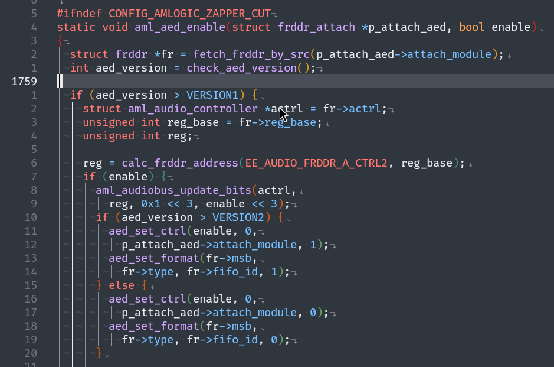

作者实测在Linux下配置了后好像不生效？调整控件值后好像听起来没区别？

## 配置RESAMPLE

resample_module属性指定要重采样的模块，模块ID在驱动代码里有，同TODDR src一样：

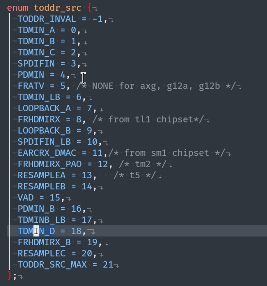

## 配置VAD

VAD用于音频唤醒处理。一般使用场景为智能音箱，不使用则可以在dts中删除所有和VAD相关的节点

## 配置LOOCKBAK

LOOPBACK可以将播放的音频回环到TODDR，便于程序直接捕获播放的音频。一般使用场景为智能音箱，用于从麦克风环境声中还原出人声，不使用则可以在dts中删除所有LOOKBACK的节点

## 配置PDM

不用PDM麦克风输入则直接删除dts节点

## 配置HDMITX的来源

```
amixer -D hw:0 cset name='HDMITX Audio Source Select' 'Spdif'
```

不知为什么通过ALSA控件配置HDMITX来源为TDMB，播放音频的时候没声音。只能像官方参考板一样配置来源为SPFIDOUT_A，再将TDMB配置为和SPDIFOUT_A samesource，最终指定TDMBOUT播放音频

## 配置引脚复用

关于TDM，共有32个TDM数据pad，TDM_D0到TDM_D31

如果数据只是在音频子系统中流转（例如FRDDR_A -> TDMOUT_C -> TOACODEC），不需要设置引脚复用。如果有外接CODEC的需求（例如TDMOUT_B -> TDM_DN -> External CODEC），则需要设置引脚复用

引脚复用分为两部分

第一部分和普通的pin一样，目的是将pad路由到音频子系统，即pad连到TDM_DN而不是GPIO或其他。驱动在`common_drivers/drivers/gpio/pinctrl/pinctrl-meson-t7.c`

第二部分负责TDM_DN和TDMIN_A/B/C/D、TDMOUT_A/B/C/D的映射

EE_AUDIO_DAT_PAD_CTRL0/1寄存器配置TDMIN_A的8个lane的输入PAD
EE_AUDIO_DAT_PAD_CTRL2/3寄存器配置TDMIN_B的8个lane的输入PAD
EE_AUDIO_DAT_PAD_CTRL4/5寄存器配置TDMIN_C的8个lane的输入PAD

EE_AUDIO_DAT_PAD_CTRL6/7/8/9/A/B/C/D寄存器配置32个TDM PAD分别来自哪个TDMOUT的哪个lane

总之每个TDM数据PAD可以很灵活的映射到不同的TDM输入或输出的任意一个lane上，这部分的驱动在`common_drivers/sound/soc/amlogic/auge/pinctrl/pctrl-audio.c`

# 相关链接

[VIM3 调试I2SB接口导致hdmi输出没有声音](https://forum.khadas.com/t/vim3-i2sb-hdmi/11488)

[Add support of MAX98091 codec with VIM3L](https://forum.khadas.com/t/add-support-of-max98091-codec-with-vim3l/13705)

[How to correctly configure audio data transfer from i2s to Android apps?](https://forum.khadas.com/t/how-to-correctly-configure-audio-data-transfer-from-i2s-to-android-apps/19605/4)

[How can I use I2S pins to output audio with Ubuntu image](https://forum.khadas.com/t/how-can-i-use-i2s-pins-to-output-audio-with-ubuntu-image/6628)
